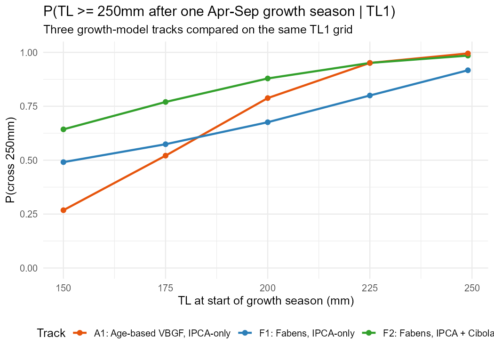

```{r setup}
library(dplyr)
library(tidyr)
library(ggplot2)
library(lubridate)
library(knitr)
library(kableExtra)
load("data/ReportingData.RData")
theme_set(theme_bw(base_size = 12))

giel_ponds <- tibble(
  location = c("IPCA (Pond 2)", "IPCA (Pond 5)", "IPCA (Pond 6)"),
  LID = c(1044L, 1047L, 1048L),
  Pond = c("Pond 2", "Pond 5", "Pond 6")
)
all_ponds <- tibble(
  location = c("Yuma Cove backwater", "IPCA (Pond 1)", "IPCA (Pond 2)",
               "IPCA (Pond 3)", "IPCA (Pond 4)", "IPCA (Pond 5)", "IPCA (Pond 6)"),
  Pond = c("YCB", "Pond 1", "Pond 2", "Pond 3", "Pond 4", "Pond 5", "Pond 6")
)

fy_of <- function(d) year(d) + (month(d) > 9)
season_bounds <- function(fy) {
  tibble(start = as.Date(sprintf("%d-10-01", fy - 1)), end = as.Date(sprintf("%d-04-30", fy)))
}

DieOffs <- read.csv("data/BWDieOffEvents.csv", stringsAsFactors = FALSE) |>
  mutate(
    StartDate = as.Date(paste0(StartMonth, "-01")),
    EndDate = ceiling_date(as.Date(paste0(EndMonth, "-01")), "month") - 1
  )
```

## Purpose and how to read this report

This report asks whether the IPCA Ponds 2, 5, and 6 Bonytail data support the structure
**Sound Science LLC has proposed** for a bonytail integrated population model (IPM) — an
annualized, Bayesian state-space model with CJS-style mark-recapture, age/size-based juvenile
stages, a per-pond stocked-vs-wild-hatched origin effect, and environmental covariates on
survival and reproduction (`documents/BONY Proposed IPM - Model Description 9-16-26.docx`,
summarized in `documents/BONY_Proposed_IPM_Summary.md`).

This is a self-contained, reproducible document: every table and figure is computed directly
from `data/ReportingData.RData` (raw PIT-tag, netting, and stocking records) and the
hand-maintained `data/BWDieOffEvents.csv` file. No survival, growth, or population model is fit
here — the goal is only to characterize the raw data available to inform the proposed IPM's
structure, so the underlying tables and CSV inputs can be shared and checked independently of
any other model output.

Scope is the off-channel component only — **IPCA Ponds 2, 5, 6**, the only sites this project
holds Bonytail data for. The open-water CJS component and Cibola High Levee Pond are outside
this project's data and are not addressed.

```{r site-inclusion}
#| include: false
# Site inclusion check (not shown in the report): the proposed model drops
# IP1, IP3, and Yuma Cove from the BONY analysis on recapture-rate grounds
# (<=5.3%) and keeps IP2, IP5, IP6 (plus CHLP, outside our data). Verified
# directly against StudyBWAnalysis; only surfaced in the report if it fails
# (see the conditional callout immediately below this chunk).
`%||%` <- function(x, y) if (length(x) == 0 || is.na(x)) y else x

SiteCheck <- StudyBWAnalysis |>
  filter(species == "GIEL") |>
  left_join(all_ponds, by = "location") |>
  group_by(Pond) |>
  summarise(
    n_tagged = n(),
    n_recap_1yr = sum(MaxDAL >= 365, na.rm = TRUE),
    recap_pct = round(100 * n_recap_1yr / n_tagged, 1),
    .groups = "drop"
  )
FullPondList <- all_ponds |>
  select(Pond) |>
  left_join(SiteCheck, by = "Pond") |>
  mutate(across(c(n_tagged, n_recap_1yr), ~replace_na(.x, 0)),
         recap_pct = replace_na(recap_pct, NA_real_))

zero_bony_ponds <- c("YCB", "Pond 1")
site_inclusion_ok <- all(FullPondList$n_tagged[FullPondList$Pond %in% zero_bony_ponds] == 0) &&
  all(FullPondList$n_tagged[FullPondList$Pond %in% c("Pond 2", "Pond 5", "Pond 6")] > 0) &&
  (FullPondList$n_tagged[FullPondList$Pond == "Pond 3"] %||% 0) <= 5
```

```{r site-inclusion-callout}
#| output: asis
if (!site_inclusion_ok) {
  cat("\n::: {.callout-warning}\n")
  cat("## Site inclusion check failed\n\n")
  cat("The proposed model's site-inclusion rule (only IP2/IP5/IP6 modeled; ",
      "IP1/IP3/Yuma Cove dropped) no longer matches `StudyBWAnalysis` -- ",
      "recheck before relying on the Pond 2/5/6 scope used throughout this report.\n\n", sep = "")
  print(kable(FullPondList,
        col.names = c("Pond", "GIEL tagged (ever)", "Recaptured ≥ 1 yr later", "Recapture %"),
        caption = "GIEL tagging and ≥1-year recapture by pond, all seven backwaters"))
  cat("\n:::\n")
}
```

## Annual-occasion detection sufficiency

The proposed model uses an **annual** time step. This section collapses `StudyBWContacts` to
one Oct–Apr occasion per fiscal year (FY) per pond — the coarsest reasonable annualization,
matching this project's existing Jan–Feb/Oct–Apr mark-recapture convention — and asks how
much information a single annual occasion carries, compared to the up to 7 months per season
(Oct–Apr) over which PIT-scan contacts are actually recorded in the raw data.

```{r annual-detect}
fy_range <- 2017:2025
AnnualWindows <- tibble(FY = fy_range) |>
  mutate(start = as.Date(sprintf("%d-10-01", FY - 1)), end = as.Date(sprintf("%d-04-30", FY)))

KnownAliveAnnual <- AnnualWindows |>
  crossing(giel_ponds |> select(Pond)) |>
  left_join(
    StudyBWAnalysis |> filter(species == "GIEL") |> left_join(giel_ponds, by = "location"),
    by = "Pond", relationship = "many-to-many"
  ) |>
  filter(first_date <= end, MaxScanDate >= start) |>
  group_by(Pond, FY) |>
  summarise(known_alive = n(), .groups = "drop")

ContactsGIEL <- StudyBWContacts |>
  filter(LID %in% giel_ponds$LID, Species == "GIEL") |>
  left_join(giel_ponds, by = "LID")

DetectedAnnual <- AnnualWindows |>
  crossing(giel_ponds |> select(Pond)) |>
  left_join(ContactsGIEL, by = "Pond", relationship = "many-to-many") |>
  filter(Date >= start, Date <= end) |>
  group_by(Pond, FY) |>
  summarise(detected = n_distinct(PITIndex), .groups = "drop")

AnnualDetect <- AnnualWindows |>
  select(FY) |>
  crossing(giel_ponds |> select(Pond)) |>
  left_join(KnownAliveAnnual, by = c("Pond", "FY")) |>
  left_join(DetectedAnnual, by = c("Pond", "FY")) |>
  mutate(across(c(known_alive, detected), ~replace_na(.x, 0)),
         annual_detect_rate = if_else(known_alive > 0, detected / known_alive, NA_real_))

# Fish detected this FY who are also detected in the immediately following FY
NextDetected <- ContactsGIEL |>
  distinct(Pond, PITIndex, Date) |>
  mutate(FY = fy_of(Date)) |>
  filter(month(Date) %in% c(10:12, 1:4)) |>
  distinct(Pond, PITIndex, FY)

AnnualRecap <- NextDetected |>
  inner_join(NextDetected |> mutate(FY = FY - 1), by = c("Pond", "PITIndex", "FY")) |>
  count(Pond, FY, name = "recap_next_fy")

AnnualDetect <- AnnualDetect |>
  left_join(DetectedAnnual |> rename(marked_this_fy = detected), by = c("Pond", "FY")) |>
  left_join(AnnualRecap, by = c("Pond", "FY")) |>
  mutate(
    recap_next_fy = replace_na(recap_next_fy, 0),
    marked_this_fy = replace_na(marked_this_fy, 0),
    sufficient = known_alive >= 15 & recap_next_fy >= 5
  )

kable(AnnualDetect |> select(Pond, FY, known_alive, marked_this_fy, annual_detect_rate,
                             recap_next_fy, sufficient) |> arrange(Pond, FY),
      digits = 2,
      col.names = c("Pond", "FY", "Known alive (Oct–Apr)", "Detected this FY",
                    "Annual detection rate", "Detected again next FY", "Sufficient?"),
      caption = "Annual (Oct–Apr) occasion detection summary, one row per pond × FY") |>
  kable_styling(bootstrap_options = c("striped", "condensed"), font_size = 12)
```

"Sufficient" here uses a low bar (≥15 fish known alive, ≥5 detected again the following FY)
— the minimum for an annual survival/detection pair to be estimated from more than a handful
of observations, not a precision target. `recap_next_fy` is the direct annual analogue of a
CJS mark-recapture count between two consecutive occasions; a single annual occasion collapses
what the raw PIT-scan record actually resolves at weekly-to-monthly grain within each Oct–Apr
season, so an annual-step CJS necessarily discards most of the within-season detection
information present in the data.

```{r annual-detect-plot, fig.height=4}
ggplot(AnnualDetect, aes(x = FY, y = annual_detect_rate)) +
  geom_col(aes(fill = sufficient)) +
  facet_wrap(~Pond, ncol = 1) +
  scale_x_continuous(breaks = fy_range) +
  scale_fill_manual(values = c(`TRUE` = "steelblue", `FALSE` = "grey70"),
                     name = "Meets low-bar sufficiency") +
  labs(x = "Fiscal year", y = "Annual detection rate (Oct–Apr occasion)",
       title = "Single-occasion annual detection rate by pond and FY")
```

## Die-off timing vs. annual-occasion boundaries

The two confirmed GIEL die-offs (IP5 2020, IP2 2022) are documented month-by-month in
`data/BWDieOffEvents.csv` and land mid-fiscal-year, not at FY boundaries. A single annual
survival parameter for the FY containing a crash necessarily averages several full-survival
months together with the acute event, diluting the fitted magnitude of the crash relative to
the true monthly-scale mortality rate — a general problem for any annual-step model asked to
represent an event that only occupies part of a year.

```{r dieoff-timing, fig.height=6}
# Both layers are faceted on the same long-form pond label ("IPCA (Pond N)")
# to avoid a facet-variable mismatch: TotalCountIPGIEL's own `Backwater`
# column uses short codes ("IP2") while BWDieOffEvents.csv's `Backwater`
# column already uses the long form -- faceting each layer on a differently-
# coded column previously produced 4 panels (2 populated, 2 blank) instead of
# the intended 3.
DieoffPlot <- TotalCountIPGIEL |>
  filter(sex == "Total", location %in% giel_ponds$location) |>
  mutate(FY = fy_of(Date),
         Pond = factor(location, levels = giel_ponds$location))
fy_starts <- tibble(FY = fy_range, start = as.Date(sprintf("%d-10-01", FY - 1))) |>
  filter(start >= min(DieoffPlot$Date), start <= max(DieoffPlot$Date))

DieOffRects <- DieOffs |>
  filter(Backwater %in% giel_ponds$location) |>
  mutate(Pond = factor(Backwater, levels = giel_ponds$location))

stopifnot(n_distinct(DieoffPlot$Pond) == 3)

ggplot(DieoffPlot, aes(x = Date, y = Count)) +
  geom_rect(data = DieOffRects,
            aes(xmin = StartDate, xmax = EndDate, ymin = -Inf, ymax = Inf),
            inherit.aes = FALSE, fill = "firebrick", alpha = 0.15) +
  geom_vline(data = fy_starts, aes(xintercept = start), linetype = "dotted", color = "grey40") +
  geom_line() +
  facet_wrap(~Pond, ncol = 1, scales = "free_y") +
  labs(x = NULL, y = "Known-alive count",
       title = "Known-alive Bonytail counts, confirmed die-off windows (red), FY boundaries (dotted)")
```

The IP5 crash (Jan–Sep 2020) spans two FYs' worth of calendar time within FY2020 alone and the
IP2 crash (Jan–Jul 2022) sits entirely inside FY2022 but well after that FY's October start —
an annual Oct–Apr occasion boundary would place the marking occasion for FY2022 *before* the
population had crashed and the next marking occasion (FY2023) entirely *after*, so the
observed annual transition would show the full magnitude of the crash correctly by coincidence
for IP2, but a coarser calendar-year annual step (as used by the proposed IPM, not
Oct–Apr-specific) could split it differently. This is a caution to check the proposed model's
actual annual step definition against these windows rather than an assumption of failure.
IPCA (Pond 6) has no confirmed die-off and no comparable crash-and-recover signature across the
same span — a within-pond contrast used again in the Environmental Covariates section below.

## Age/origin stage sufficiency

The proposed model splits juvenile survival into age-0/age-1 annual steps and estimates a
per-pond stocked-vs-wild-hatched origin effect. Both require enough wild-hatched
(net-captured, not stocked) juveniles tagged and later re-encountered. The table below is
computed live from `StudyBWAnalysis`.

```{r wildhatched}
WildHatched <- StudyBWAnalysis |>
  filter(species == "GIEL", event == "capture", total_length < 250) |>
  left_join(giel_ponds, by = "location") |>
  mutate(FY = fy_of(first_date)) |>
  filter(FY %in% fy_range)

WildHatchedTab <- WildHatched |>
  group_by(Pond, FY) |>
  summarise(
    n_tagged = n(),
    n_recap_1yr = sum(MaxDAL >= 365, na.rm = TRUE),
    prop_recap = round(n_recap_1yr / n_tagged, 2),
    median_TL = round(median(total_length, na.rm = TRUE), 1),
    sd_TL = round(sd(total_length, na.rm = TRUE), 1),
    .groups = "drop"
  ) |>
  right_join(crossing(Pond = giel_ponds$Pond, FY = fy_range), by = c("Pond", "FY")) |>
  mutate(across(c(n_tagged, n_recap_1yr), ~replace_na(.x, 0)),
         sufficient = n_tagged >= 15 & n_recap_1yr >= 10) |>
  arrange(Pond, FY)

kable(WildHatchedTab,
      col.names = c("Pond", "FY", "Wild-hatched tagged", "Recontacted ≥ 1 yr",
                    "Prop. recontacted", "Median TL (mm)", "SD TL (mm)", "Sufficient for origin/age split?"),
      caption = "Wild-hatched (net-captured, <250mm TL) juveniles tagged by pond and FY") |>
  kable_styling(bootstrap_options = c("striped", "condensed"), font_size = 12)

n_suff <- sum(WildHatchedTab$sufficient, na.rm = TRUE)
n_total <- nrow(WildHatchedTab)
```

`r n_suff` of `r n_total` pond-years (`r round(100*n_suff/n_total)`%) clear even this low bar
(≥15 tagged, ≥10 recontacted ≥1 yr later).

```{r wildhatched-plot, fig.height=4}
ggplot(WildHatchedTab, aes(x = FY, y = n_tagged, fill = sufficient)) +
  geom_col() +
  facet_wrap(~Pond, ncol = 1) +
  scale_x_continuous(breaks = fy_range) +
  scale_fill_manual(values = c(`TRUE` = "steelblue", `FALSE` = "grey70"), name = "Sufficient?") +
  labs(x = "Fiscal year", y = "Wild-hatched juveniles tagged",
       title = "Wild-hatched recruits tagged by pond and season")
```

```{r size-histograms, fig.height=6}
ggplot(WildHatched, aes(x = total_length)) +
  geom_histogram(binwidth = 15, boundary = 0) +
  facet_grid(FY ~ Pond) +
  labs(x = "Total length at tagging (mm)", y = "Count",
       title = "Size at tagging for wild-hatched Bonytail, by pond and season") +
  theme(strip.text.y = element_text(angle = 0))
```

No pond-season shows a visually separable bimodal split corresponding to "this year's young"
vs. "last year's survivors held over" — sizes form a broad, largely continuous spread within
each season. The age-0/age-1 assignment the proposed model needs therefore cannot come from
raw size-at-tagging alone; it depends entirely on the fitted growth curve discussed next.

## Growth-curve identifiability for hatch-year assignment

The proposed age-based structure back-calculates each wild-hatched recruit's hatch year from
length via a single fitted von Bertalanffy growth curve. This project has already fit that
curve, under three different data-pooling choices, in `model/GIEL_GrowthTrackComparison.R`
(full detail in `model/GIEL_GrowthTrackComparison_Summary.md`). In every version, the fitted
asymptotic size (`Linf`) collapsed **below** the largest Bonytail actually measured in these
ponds — a classic symptom of too few recaptures near the adult size ceiling, not a bug in any
one fit. The figure below (reproduced from that completed model, not re-fit here) shows how
much the resulting probability-of-maturation curves diverge across model choices, particularly
at smaller sizes — the same instability that would propagate into any hatch-year
back-calculation.

```{r growth-curve-fig}
#| fig-cap: "Existing GIEL growth-track model comparison (reused from `model/GIEL_GrowthTrackComparison.R`)"

```

**Practical consequence:** even within the pond-years flagged as "sufficient" above, any
age-0/age-1 split or hatch-year assignment inherits this curve's uncertainty, which is worst
for exactly the smaller, more numerous wild-hatched fish that dominate the tagged sample.

## Origin composition per pond-year

For a per-pond origin effect (stocked vs. wild-hatched) to be estimable at all, a pond-season
needs *both* origins present in meaningful numbers. This extends the wild-hatched-only table
above to include stocked fish for context.

```{r origin-comp}
OriginTab <- StudyBWAnalysis |>
  filter(species == "GIEL") |>
  left_join(giel_ponds, by = "location") |>
  mutate(FY = fy_of(first_date), origin_lab = if_else(event == "stocking", "Stocked", "Wild-hatched")) |>
  filter(FY %in% fy_range) |>
  count(Pond, FY, origin_lab) |>
  pivot_wider(names_from = origin_lab, values_from = n, values_fill = 0) |>
  right_join(crossing(Pond = giel_ponds$Pond, FY = fy_range), by = c("Pond", "FY")) |>
  mutate(across(c(Stocked, `Wild-hatched`), ~replace_na(.x, 0)),
         both_present = Stocked > 0 & `Wild-hatched` > 0) |>
  arrange(Pond, FY)

kable(OriginTab, col.names = c("Pond", "FY", "Stocked tagged", "Wild-hatched tagged", "Both origins present?"),
      caption = "Stocked vs. wild-hatched Bonytail tagged, by pond and FY") |>
  kable_styling(bootstrap_options = c("striped", "condensed"), font_size = 12)

n_both <- sum(OriginTab$both_present)
```

Only `r n_both` of `r nrow(OriginTab)` pond-years have any stocked and any wild-hatched fish
tagged in the same season — most pond-years are effectively single-origin, meaning an
origin effect is identified mainly by *between*-season, not *within*-season, contrast, and is
confounded with whatever season-to-season variation (including the two known crashes) coincides
with a change in which origin dominates.

## Reproduction (F) data availability

The proposed model estimates reproduction (F) from parentage assignment of genotyped
larvae/YOY against a near-complete genotyped adult pool. This project's genetics pipeline
currently has parentage data only for Yuma Cove and IPCA Pond 1 **Razorback Sucker** — there is
no GIEL parentage join in this project's data. A separate University of New Mexico dataset with
some bonytail parentage data exists (a coarse pond/year/stage/N summary,
`data/UNM_GIEL_ParentageSampling.csv`), but its coverage of IP2/5/6 specifically, its temporal
span, and whether it is available at the individual-assignment level (vs. summary statistics
only) are open questions this report cannot resolve. No new data pull is attempted here — this
is a documented capability gap, not a data-sufficiency result this report can compute.

## Environmental covariates

Dissolved oxygen, temperature, and water-level series are not currently collected or stored for
any IPCA pond in this project, but that is a data-collection timeline issue, not a critique —
Sound Science's proposal is expected to supply this data. The substantive question this section
asks instead is whether *any* covariate model (environmental or otherwise, pooled across ponds
per the proposal's own §1.6 design) could be identified from how these three ponds have actually
been managed and monitored, independent of whether the covariate series themselves are good.

**Pond × year events are not crossed.** A covariate model with slopes shared across ponds and
intercepts/year-effects specific to each needs a pond × year design where "what happened" isn't
perfectly aliased with "which pond, which year." The table below (built from data already loaded
in this report — stocking events in `StudyBWAnalysis`, confirmed die-off windows in
`data/BWDieOffEvents.csv`, and the known-alive counts computed in the Annual-occasion section
above) shows the opposite: each pond's major events land in different, pond-specific years.

```{r event-calendar}
StockingByPondFY <- StudyBWAnalysis |>
  filter(species == "GIEL", event == "stocking") |>
  left_join(giel_ponds, by = "location") |>
  mutate(FY = fy_of(first_date)) |>
  filter(FY %in% fy_range) |>
  distinct(Pond, FY) |>
  mutate(stocked = TRUE)

DieoffByPondFY <- DieOffs |>
  filter(Backwater %in% giel_ponds$location) |>
  left_join(giel_ponds, by = c("Backwater" = "location")) |>
  mutate(FY = fy_of(StartDate)) |>
  distinct(Pond, FY) |>
  mutate(dieoff = TRUE)

EventCalendar <- AnnualDetect |>
  select(Pond, FY, known_alive) |>
  left_join(StockingByPondFY, by = c("Pond", "FY")) |>
  left_join(DieoffByPondFY, by = c("Pond", "FY")) |>
  mutate(
    stocked = replace_na(stocked, FALSE),
    dieoff = replace_na(dieoff, FALSE),
    status = case_when(
      dieoff ~ "Confirmed die-off",
      stocked ~ "Stocking event",
      known_alive == 0 ~ "No fish present",
      TRUE ~ "Routine"
    )
  )

ggplot(EventCalendar, aes(x = FY, y = Pond, fill = status)) +
  geom_tile(color = "white") +
  scale_x_continuous(breaks = fy_range) +
  scale_fill_manual(values = c(
    "Confirmed die-off" = "firebrick", "Stocking event" = "steelblue",
    "No fish present" = "grey85", "Routine" = "grey55"
  ), name = NULL) +
  labs(x = "Fiscal year", y = NULL,
       title = "Pond × FY event calendar: stocking, confirmed die-offs, and routine years")
```

IP5's crash (FY2020) and IP2's crash (FY2022) do not coincide, IP6 has neither, and stocking
timing also differs by pond (e.g. the FY2025 restock). Any pond-level environmental series
inherits this same non-crossed structure: a year with unusual water quality at one pond is not
matched by a comparable observation at the others in that same year, so a shared covariate slope
cannot cleanly separate "this year was different" from "this pond is different."

**Variability already visible in the raw contact record, with no obvious smooth pattern.** As a
data-only (not model-fitted) check, the chunk below computes a simple apparent-retention proxy
for each non-event pond-season directly from `StudyBWContacts`: of the fish detected at all
within a given FY's Oct–Apr window, what fraction are detected again in the following FY's
Oct–Apr window. This is **not** a survival estimate — it mixes true mortality with detection
probability and emigration/transfer — but it is a fully transparent, reproducible summary of
how much year-to-year change the raw data already show, computed with no model of any kind.

```{r retention-proxy}
RetentionTab <- AnnualDetect |>
  left_join(DieoffByPondFY, by = c("Pond", "FY")) |>
  mutate(dieoff = replace_na(dieoff, FALSE)) |>
  filter(marked_this_fy >= 5, !dieoff, FY <= max(fy_range) - 1) |>
  mutate(retention_rate = round(recap_next_fy / marked_this_fy, 2))

kable(RetentionTab |> select(Pond, FY, marked_this_fy, recap_next_fy, retention_rate),
      col.names = c("Pond", "FY", "Detected this FY", "Also detected next FY", "Apparent retention"),
      caption = "Non-event pond-seasons: fraction of fish detected in one FY also detected the next") |>
  kable_styling(bootstrap_options = c("striped", "condensed"), font_size = 12)

within_sd_tab <- RetentionTab |> group_by(Pond) |> summarise(sd_within = sd(retention_rate), .groups = "drop")
pond_mean_tab <- RetentionTab |> group_by(Pond) |> summarise(mean_retention = mean(retention_rate), .groups = "drop")
sd_within_avg <- round(mean(within_sd_tab$sd_within, na.rm = TRUE), 2)
sd_among_ponds <- round(sd(pond_mean_tab$mean_retention), 2)
retention_range <- round(range(RetentionTab$retention_rate), 2)
n_pondseasons <- nrow(RetentionTab)
```

Across `r n_pondseasons` non-event pond-seasons, apparent retention ranges from
`r retention_range[1]` to `r retention_range[2]` with no obvious smooth trend by year or pond.
Year-to-year variation *within* a pond (average SD `r sd_within_avg`) is larger than the
variation *among* the three ponds' average rates (SD `r sd_among_ponds`) — i.e., knowing which
pond a fish is in predicts this proxy less well than knowing which year it is, and neither
predicts it consistently. That is the kind of noisy, structureless variability a covariate model
needs to *not* have if it is going to attribute any of it to a measured environmental driver —
there is not yet an evident, consistent pattern here for water-quality data to explain, either
within a pond across years or across ponds within a year.

**Pond 2's sample size could flood a pooled model.** With any of this in mind, it's reasonable to
ask whether environmental data could still help explain a real, specific pattern visible in the
table above — Pond 2's apparent retention is the lowest of the three ponds in most non-event
years. The risk is that Pond 2 dominates the available juvenile sample so heavily that a
pooled-slope model would mostly be fitting Pond 2's own history, not a genuine cross-pond
relationship:

```{r pond2-share}
Pond2Share <- WildHatchedTab |>
  group_by(Pond) |>
  summarise(n_tagged = sum(n_tagged), .groups = "drop") |>
  mutate(pct = round(100 * n_tagged / sum(n_tagged), 1))
kable(Pond2Share, col.names = c("Pond", "Wild-hatched tagged (all FY)", "% of 3-pond total"),
      caption = "Share of tagged wild-hatched GIEL juveniles by pond") |>
  kable_styling(bootstrap_options = c("striped", "condensed"), full_width = FALSE)
pond2_pct <- Pond2Share$pct[Pond2Share$Pond == "Pond 2"]
```

Pond 2 alone supplies `r pond2_pct`% of all tagged wild-hatched GIEL juveniles across the three
ponds. A pooled-slope covariate model (per the proposal's own §1.6 design: slopes shared across
ponds, intercepts pond-specific) fit against a sample this imbalanced would be dominated by
whatever is idiosyncratic about Pond 2's history, well before IP5 or IP6 could contribute a
meaningfully different contrast — a caution to weigh even if a genuine juvenile/adult-survival
signal turns out to exist.

**Recommendation.** Once DO/temperature/water-level data exist, first test whether they simply
co-vary with (i.e., flag) the two known pump-failure windows documented in
`data/BWDieOffEvents.csv`, rather than assuming a continuous relationship. That check should
explicitly report the non-orthogonality and sample-imbalance issues raised above — e.g., via a
pond-stratified or leave-one-pond-out sensitivity comparison — rather than fitting a single
pooled slope and treating a significant coefficient as confirmatory on its own.

## Summary and conclusions

```{r summary-table}
SummaryTab <- AnnualDetect |>
  select(Pond, FY, annual_sufficient = sufficient) |>
  full_join(WildHatchedTab |> select(Pond, FY, origin_sufficient = sufficient), by = c("Pond", "FY")) |>
  left_join(
    DieOffs |> mutate(Pond2 = case_when(
      Backwater == "IPCA (Pond 2)" ~ "Pond 2",
      Backwater == "IPCA (Pond 5)" ~ "Pond 5",
      TRUE ~ NA_character_
    )) |> filter(!is.na(Pond2)) |>
      mutate(FY = fy_of(StartDate)) |> distinct(Pond = Pond2, FY) |> mutate(event_window = TRUE),
    by = c("Pond", "FY")
  ) |>
  mutate(event_window = replace_na(event_window, FALSE)) |>
  arrange(Pond, FY)

kable(SummaryTab,
      col.names = c("Pond", "FY", "Annual detection sufficient?", "Origin/age split sufficient?", "Confirmed die-off?"),
      caption = "Combined pond × FY sufficiency for the proposed annualized IPM structure") |>
  kable_styling(bootstrap_options = c("striped", "condensed"), font_size = 12)
```

Across `r nrow(SummaryTab)` pond-years: annual-occasion detection clears the low bar in
`r sum(SummaryTab$annual_sufficient, na.rm=TRUE)` pond-years, and the age/origin split clears
its low bar in `r sum(SummaryTab$origin_sufficient, na.rm=TRUE)`. Very few pond-years satisfy
both simultaneously. Combined with the other findings in this report — pond × year events that
are not crossed, apparent retention that varies more within a pond across years than among
ponds with no smooth pattern, no GIEL-specific F pipeline, a growth curve too unstable to
support hatch-year back-calculation for larger recruits, and a juvenile sample overwhelmingly
concentrated in one pond — the annual, multi-stage, covariate-rich structure proposed for
bonytail is supported by real data in only a minority of pond-years, concentrated in IP2 and
IP6; IP5, the pond with the more severe documented crash, has the least data of the three to
support any of the proposed model's finer structure.
