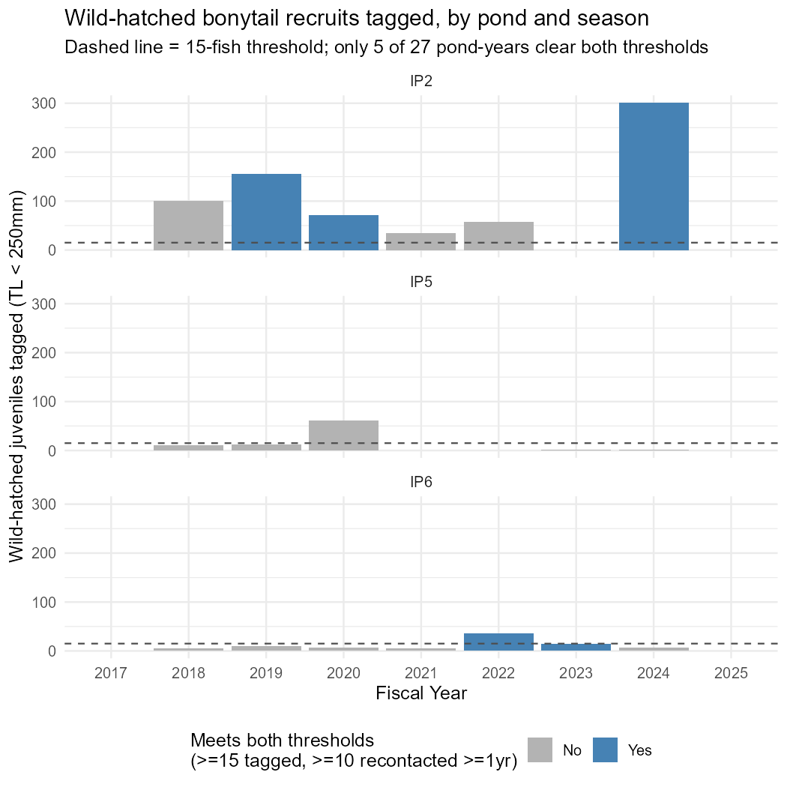
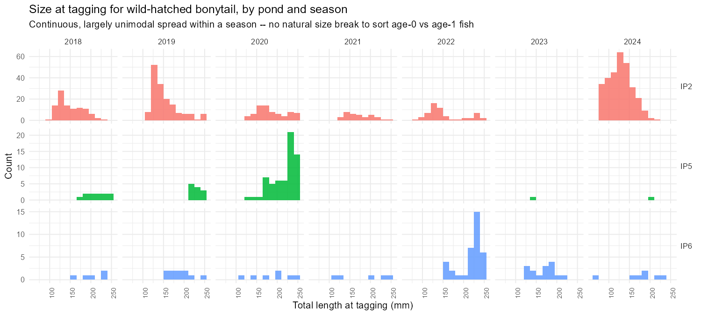
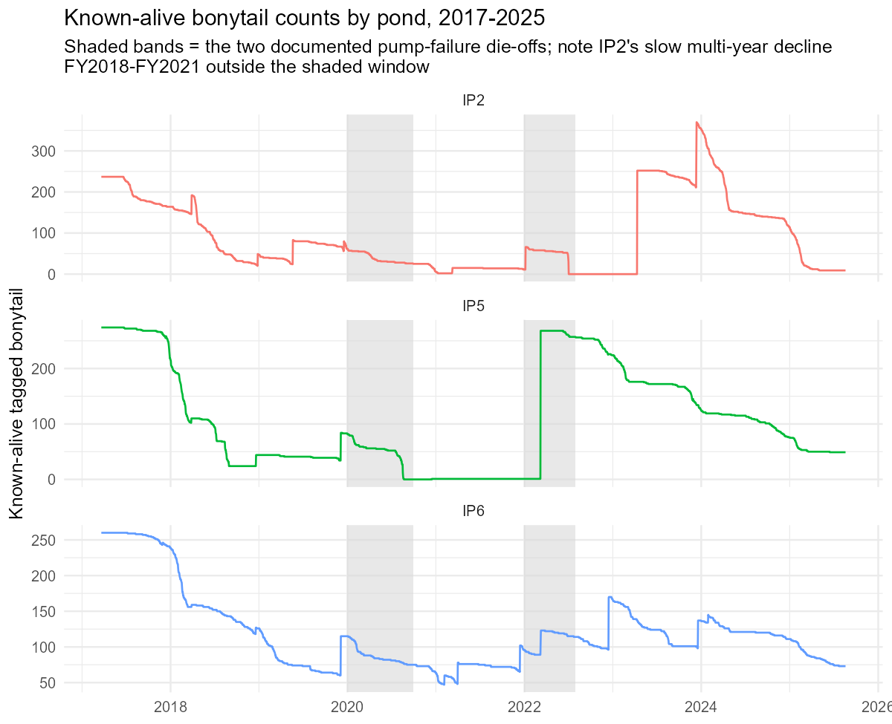

# Critique of the 9-16-26 Proposed Bonytail IPM (Sound Science LLC)

**Subject document:** `documents/BONY Proposed IPM - Model Description 9-16-26.docx`
**Scope:** Off-channel (OCH) component only — IPCA Ponds 2, 5, 6 (this project's data). The
open-water CJS component is not addressed here (see `model/BONY_ProposedIPM_Critique.md` §5
for the Lake Havasu precedent, which still applies unchanged).
**Method:** Every table and figure below is built directly from `data/ReportingData.RData`
(`StudyBWAnalysis`, `TotalCountIPGIEL`) using simple filters, joins, and counts — no NIMBLE or
other model was run to produce this document. Section 4 is the one exception: it restates
findings already produced by a completed, previously-documented model fit
(`model/GIEL_GrowthTrackComparison.R`) rather than re-deriving them.

---

## 1. What the 9-16-26 draft changed, and why that matters

The 16 September draft replaces the earlier size-stage structure with an **age-based** one:
juvenile survival is now split into two annual steps, age 0→1 and age 1→2, and each
wild-hatched recruit's age is assigned by back-calculating its hatch year from length through a
single fitted growth curve. Reproduction (F) is estimated from recruit counts tabulated by hatch
year and by the year each fish was first netted. An origin effect (stocked vs. wild-hatched),
allowed to vary by pond, is layered on top of both survival stages.

All three of these — an age-0/1 split, hatch-year assignment, and a per-pond origin effect —
require enough tagged, subsequently re-encountered wild-hatched fish to estimate. The next three
sections quantify how much of that a pond-year actually needs to have, and how many of our 27
pond-years (3 ponds × FY2017–FY2025) actually clear that bar.

---

## 2. How many pond-years have enough wild-hatched recruits?

**Definitions.** A "wild-hatched juvenile" is a fish first recorded via a `capture` event (not a
stocking record) at a total length under 250 mm — the existing project threshold for the
GIEL juvenile/adult boundary (`StageTL`). "Recontacted ≥1 yr later" uses each fish's own
`MaxDAL` (its own maximum days-at-large across all contacts) ≥ 365 days: the minimum needed for
even one full annual survival interval to be informed by that fish. "Sufficient" pond-years
require **both** ≥15 wild-hatched fish tagged **and** ≥10 of them recontacted a year or more
later — a low bar (not the number needed for a precise estimate), but the minimum for a
pond-year to contribute anything beyond a handful of degenerate observations to an
origin-specific or age-specific survival parameter.

| Pond |   FY| Wild-hatched tagged| Recontacted ≥1yr| Prop. recontacted| Median TL (mm)| SD TL (mm)|Sufficient for origin split? |
|:----|----:|-------------------:|-----------------:|-----------------:|--------------:|----------:|:----------------------------|
|IP2  | 2017|                   0|                 0|                NA|             NA|         NA|No                           |
|IP2  | 2018|                 100|                 9|              0.09|          142.0|       31.0|No                           |
|IP2  | 2019|                 155|                20|              0.13|          142.0|       32.0|**Yes**                      |
|IP2  | 2020|                  71|                10|              0.14|          179.0|       34.9|**Yes**                      |
|IP2  | 2021|                  35|                 3|              0.09|          168.0|       31.5|No                           |
|IP2  | 2022|                  58|                 0|              0.00|          138.5|       45.4|No                           |
|IP2  | 2023|                   0|                 0|                NA|             NA|         NA|No                           |
|IP2  | 2024|                 301|                47|              0.16|          129.0|       28.7|**Yes**                      |
|IP2  | 2025|                   0|                 0|                NA|             NA|         NA|No                           |
|IP5  | 2017|                   0|                 0|                NA|             NA|         NA|No                           |
|IP5  | 2018|                  11|                 9|              0.82|          221.0|       23.7|No                           |
|IP5  | 2019|                  12|                 7|              0.58|          230.5|       11.2|No                           |
|IP5  | 2020|                  62|                 0|              0.00|          227.5|       29.2|No                           |
|IP5  | 2021|                   0|                 0|                NA|             NA|         NA|No                           |
|IP5  | 2022|                   0|                 0|                NA|             NA|         NA|No                           |
|IP5  | 2023|                   1|                 0|              0.00|          141.0|         NA|No                           |
|IP5  | 2024|                   1|                 0|              0.00|          207.0|         NA|No                           |
|IP5  | 2025|                   0|                 0|                NA|             NA|         NA|No                           |
|IP6  | 2017|                   0|                 0|                NA|             NA|         NA|No                           |
|IP6  | 2018|                   5|                 3|              0.60|          210.0|       32.2|No                           |
|IP6  | 2019|                  10|                 7|              0.70|          190.5|       27.7|No                           |
|IP6  | 2020|                   7|                 6|              0.86|          200.0|       49.2|No                           |
|IP6  | 2021|                   5|                 2|              0.40|          203.0|       62.8|No                           |
|IP6  | 2022|                  36|                24|              0.67|          230.5|       27.8|**Yes**                      |
|IP6  | 2023|                  15|                11|              0.73|          170.0|       26.8|**Yes**                      |
|IP6  | 2024|                   7|                 4|              0.57|          190.0|       51.5|No                           |
|IP6  | 2025|                   0|                 0|                NA|             NA|         NA|No                           |

**Bottom line: only 5 of 27 pond-years (18%) clear even this low bar — 3 at IP2, 2 at IP6, and
zero at IP5.** IP5 is one of the two ponds with a documented catastrophic die-off, so it is
exactly the pond where an origin- or age-specific survival contrast would be most informative
about crash/recovery dynamics — and it is also the pond with the least data to estimate one.
Eighteen of the 27 cells have essentially no wild-hatched fish at all (≤12, several with zero).

The proposed model specifies a pond-specific origin deviation for *every* pond, and an age-0/1
juvenile survival step estimated from wherever wild-hatched fish were tagged young — but the raw
tagging counts show that structure has real data behind it in only about a fifth of the
pond-years it's meant to cover, concentrated almost entirely in IP2 and IP6.

---

## 3. The age-0/1 split has no natural anchor in the raw size data

Beyond simple sample size, the proposed age-0 vs. age-1 juvenile survival split needs some way
to tell which wild-hatched fish belong to which age class. The document's mechanism for this is
entirely indirect: age comes from back-calculating hatch year through a fitted growth curve
(Section 4), not from any direct age determination (no otoliths are collected).

If two age classes were regularly present and separable *within* a single season's netting, a
model could in principle resolve them without leaning on a growth curve — but the raw
length-at-tagging data don't show that pattern. Within almost every pond-season, wild-hatched
fish span a broad, largely continuous range of 30–60 mm SD rather than clustering into two
distinguishable groups:

There is no season/pond combination where the histogram splits into two visually separate modes
corresponding to "this year's young" and "last year's survivors held over." That means the
age-0/1 assignment the proposed model needs is not something the raw capture-event data can
supply on their own — it has to come from the fitted growth curve, which is the subject of the
next section.

---

## 4. The growth curve the age/hatch-year system depends on is already known to be unstable

This section restates a result from a model we've already fit and fully documented
(`model/GIEL_GrowthTrackComparison.R`, `model/GIEL_GrowthTrackComparison_Summary.md`) — it is
not a new model run for this critique.

The proposed IPM's entire age/hatch-year machinery (Sections 2 and 5 of the 9-16-26 document)
depends on assigning each wild-hatched recruit to a hatch year via a single von Bertalanffy
growth curve fit to recaptured GIEL. We have already fit this curve — twice, under different
data-pooling choices — for these same three ponds, and both times the fitted asymptotic size
(`Linf`) collapsed *below* the largest bonytail actually measured in the ponds (417.7 mm fitted
vs. 462 mm observed), a textbook symptom of too few recaptures near the adult size ceiling. We
also tried per-pond asymptotes and a tighter prior forcing `Linf` toward a literature-typical
value; neither fixed it, and pooling in an external historical pond's data only partially closed
the gap. Our standing conclusion (documented in `AGENTS.md` and the growth-model summary files)
is that this is **not fixable with the recapture data currently available**, and that the fitted
curve should be used only for interpolation within the well-populated size range — not treated
as a literal growth trajectory that can be inverted to assign a reliable hatch year, especially
for larger recruits.

*(Figure reused verbatim from the completed growth-model fit; shows how differently three
already-fitted growth-model variants extrapolate probability of reaching 250 mm within one
growing season — the same curve-shape sensitivity that would carry into any hatch-year
back-calculation.)*

Practical consequence: even in the 5 pond-years identified in Section 2 as having "enough" fish,
the age-0/1 split and the hatch-year assignment feeding F both inherit whatever hatch-year
misclassification this curve produces — and that misclassification is likely worse, not better,
for the wild-hatched fish in this dataset, since they are on average smaller and more numerous
at the low end of the size range where the curve is least anchored.

---

## 5. Real crashes don't line up with the pond-year random-effect design

The proposed model attributes the two known catastrophic mortality events (IP5 2020, IP2 2022 —
both well pump failures) to pond-year random effects, and expects environmental covariates
(dissolved oxygen, temperature, water level) to explain whatever survival variation is left once
those events are accounted for.

The known-alive time series shows a pattern that complicates this framing for IP2 specifically:

IP5 (middle panel) matches the proposed design well — a stable population that collapses sharply
and entirely within the shaded 2020 die-off window, then rebuilds after restocking. **IP2 (top
panel) does not** — its known-alive count falls continuously from 237 fish (2017 stocking) to
near zero *before* the shaded 2022 window even begins, a decline spanning FY2018–FY2021 that
the document's own attribution (a single dated pump failure) does not cover. A pond-year random
effect can absorb a sharp, one-season shock; it is not obviously suited to representing a slow,
four-year decline that a single dated event doesn't explain, and there's no discussion in the
document of what would happen if a pond's low survival isn't event-shaped at all. IP6 (bottom
panel), by contrast, shows a gradual decline with small recruitment-driven upticks and no
crash — the model's default assumption (a pond-specific baseline plus one-off shocks) seems to
fit IP6 reasonably well, but not IP2.

This also bears on the environmental-covariate strategy: if IP2's problem is a multi-year
process the model has no term for, adding DO/temperature/water-level covariates on top of an
event-based die-off correction won't diagnose it — those covariates would only be asked to
explain whatever survival variation the random effects and origin/age terms don't already soak
up, and IP2's chronic decline is exactly the kind of unmodeled structure that could get
misattributed to an environmental slope that has nothing to do with it.

---

## 6. How much "normal" data is actually left to fit anything on?

Putting Sections 2 and 5 together: of the 27 pond-year cells, 2 are entirely inside the
documented die-off windows (IP5 FY2020, IP2 FY2022) and several more (IP2 FY2018–FY2021) sit
inside IP2's undocumented chronic decline. That leaves a small number of pond-years that are
both "normal" (not inside a known or suspected mortality event) *and* have enough wild-hatched
fish to inform anything — in practice, closer to the 5 flagged in Section 2 than to the full
27-cell design. Fitting shared covariate slopes (the proposal's own stated reason for pooling
slopes across ponds rather than letting them vary — "too few ponds to do otherwise") on this
few informative pond-years risks the same problem in miniature: not enough independent,
uncontaminated observations to distinguish a real covariate effect from noise, regardless of how
the model is structured.

---

## 7. Summary

| Proposed model element | What it requires | What the raw data show |
|---|---|---|
| Age-0/1 juvenile survival split | Reliable per-fish age at tagging | No natural size clusters within a season (Sec. 3); age comes only from a growth curve already shown to be unstable (Sec. 4) |
| Origin-specific survival deviation by pond | ≥10-20 wild-hatched fish tagged and re-encountered per pond-year | Only 5 of 27 pond-years clear a low bar (≥15 tagged, ≥10 recontacted); **zero at IP5** (Sec. 2) |
| Hatch-year assignment for recruitment (F) | An anchored, well-identified growth curve | `Linf` collapses below the largest observed fish in every version fit so far (Sec. 4) |
| Pond-year random effect absorbing die-offs | Mortality events that are single-season and dated | Matches IP5 well; **does not match IP2's slow, multi-year, currently unexplained decline** (Sec. 5) |
| Shared environmental covariate slopes | Enough "normal," uncontaminated pond-years for real contrast | A small remaining set once known/suspected event years are excluded (Sec. 6) |

None of these problems require running a new model to see — they are visible directly in the raw
tagging, recapture, and known-alive records already in `data/ReportingData.RData`. The proposed
IPM's added structure (age steps, hatch-year assignment, per-pond origin effects, environmental
covariate slopes) is asking more of this bonytail dataset than the dataset, on its own terms,
appears to have to give.
