# Three-stage XYTE robust-design model — scientific review package

Note

This report was generated using AI under general human direction. At the time of generation, the contents have not been comprehensively reviewed by a human analyst.

``` r
library(tidyverse)
```

    ── Attaching core tidyverse packages ──────────────────────── tidyverse 2.0.0 ──
    ✔ dplyr     1.2.1     ✔ readr     2.2.0
    ✔ forcats   1.0.1     ✔ stringr   1.6.0
    ✔ ggplot2   4.0.3     ✔ tibble    3.3.1
    ✔ lubridate 1.9.5     ✔ tidyr     1.3.2
    ✔ purrr     1.2.2     
    ── Conflicts ────────────────────────────────────────── tidyverse_conflicts() ──
    ✖ dplyr::filter() masks stats::filter()
    ✖ dplyr::lag()    masks stats::lag()
    ℹ Use the conflicted package (<http://conflicted.r-lib.org/>) to force all conflicts to become errors

``` r
library(lubridate)
library(coda)
library(posterior)
```

    This is posterior version 1.7.0

    Attaching package: 'posterior'

    The following objects are masked from 'package:stats':

        mad, sd, var

    The following objects are masked from 'package:base':

        %in%, match

``` r
library(knitr)
library(kableExtra)
```


    Attaching package: 'kableExtra'

    The following object is masked from 'package:dplyr':

        group_rows

``` r
library(patchwork)
library(ggrepel)
theme_set(theme_bw(base_size = 12))

CUR_FILE  <- "../data/YCB3S_MCMC_xyte_m12.RData"
PREV_FILE <- "../data/YCB3S_MCMC_xyte_m12_noEvt.RData"
DATA_FILE <- "../data/YCB3S_data_xyte_m12.RData"

mc   <- new.env(); load(CUR_FILE,  envir = mc)
prev <- new.env(); load(PREV_FILE, envir = prev)
dd   <- new.env(); load(DATA_FILE, envir = dd)

post      <- as.matrix(mc$rd3_samples)
post_prev <- as.matrix(prev$rd3_samples)
n_draw <- nrow(post)

Fish      <- dd$Fish |> mutate(count_from = entry_t + as.integer(origin == 2L))
Primary   <- dd$Primary
Netting   <- mc$Netting
RecruitIndex <- mc$RecruitIndex
SplitObs  <- mc$SplitObs
PondTable <- mc$PondTable
NS <- dd$N_SEASONS
T_PRIM <- dd$T_PRIM
Evt <- dd$Evt
nEvt <- dd$nEvt
DieOffs <- dd$DieOffsRaw
y_mat <- dd$y_mat; K_mat <- dd$K_mat; stobs_mat <- dd$stobs_mat
eff_std <- dd$eff_std
dens_center <- dd$dens_center; dens_scale <- dd$dens_scale
FIRST_FY <- dd$FIRST_FY

pond_lab <- PondTable$Backwater
NP <- nrow(PondTable)
fy_lab <- paste0("FY", FIRST_FY + seq_len(NS) - 1)
season_tbl <- tibble(season = seq_len(NS), FY = fy_lab)
stage_lab <- c("S (< 300 mm)", "L (300\u2013349 mm)", "A (\u2265 350 mm)")

pcol  <- function(p, x = post) x[, grep(p, colnames(x)), drop = FALSE]
qsum  <- function(x) c(mean = mean(x), lwr = unname(quantile(x, 0.025)), med = median(x), upr = unname(quantile(x, 0.975)))
ci_str <- function(x, d = 2) sprintf(paste0("%.", d, "f (%.", d, "f\u2013%.", d, "f)"), mean(x), quantile(x, 0.025), quantile(x, 0.975))
node_or_na <- function(p, node) if (node %in% colnames(p)) p[, node] else rep(NA_real_, nrow(p))

# Convert a coda mcmc.list into a posterior::draws_array for rhat/ESS
to_draws_array <- function(mcmc_list) {
  m <- lapply(mcmc_list, as.matrix)
  vn <- colnames(m[[1]])
  arr <- array(unlist(m), dim = c(nrow(m[[1]]), ncol(m[[1]]), length(m)))
  arr <- aperm(arr, c(1, 3, 2))
  dimnames(arr) <- list(NULL, NULL, vn)
  as_draws_array(arr)
}
draws_cur  <- to_draws_array(mc$rd3_samples)
draws_prev <- to_draws_array(prev$rd3_samples)

diag_cur <- summarise_draws(draws_cur, mean, median, ~quantile2(.x, probs = c(0.025, 0.975)), rhat, ess_bulk, ess_tail)
diag_prev <- summarise_draws(draws_prev, mean, median, ~quantile2(.x, probs = c(0.025, 0.975)), rhat, ess_bulk, ess_tail)

# Family = node name with the index stripped; used to group the ~2,000 monitored nodes
diag_cur <- diag_cur |> mutate(family = sub("\\[.*", "", variable),
                                is_abund = family %in% c("N_tag", "U", "RecJ", "r", "Tal", "Atot"),
                                sp2 = grepl("^(mu_phi|sigma_phi|dJ|dS|b_post|sigma_J|lpsiSL|lpsiLA|a0|a1|g_eff|mu_r|sigma_r|nu|d_moy)\\[2", variable))
```

## Purpose and fit identification

``` r
tibble(
  Item = c("Current fit (\"this run\")", "Previous fit (\"vXX\")", "Data build",
           "Ponds modeled", "Calendar", "Chains", "Iterations / burn-in / thin", "Retained draws",
           "Wall time, current (min)", "Wall time, previous (min)", "Structural difference"),
  Value = c(sub("^\\.\\./", "", CUR_FILE), sub("^\\.\\./", "", PREV_FILE),
            format(dd$BUILD_INFO$built, "%Y-%m-%d %H:%M"),
            paste(pond_lab, collapse = ", "), dd$BUILD_INFO$CALENDAR,
            mc$rd3_settings$N_CHAINS,
            paste(mc$rd3_settings$N_ITER, mc$rd3_settings$N_BURNIN, mc$rd3_settings$N_THIN, sep = " / "),
            n_draw, round(as.numeric(mc$rd3_settings$run_time), 1), round(as.numeric(prev$rd3_settings$run_time), 1),
            "Pond-specific mortality-event offset `dE[pond]` added; applied in the calendar months flagged in `data/BWDieOffEvents.csv`")
) |> kable() |> kable_styling(full_width = FALSE, position = "left")
```

| Item | Value |
|:---|:---|
| Current fit ("this run") | data/YCB3S_MCMC_xyte_m12.RData |
| Previous fit ("vXX") | data/YCB3S_MCMC_xyte_m12_noEvt.RData |
| Data build | 2026-09-09 09:16 |
| Ponds modeled | YCB, IP1, IP3, IP4 |
| Calendar | m12 |
| Chains | 3 |
| Iterations / burn-in / thin | 30000 / 10000 / 10 |
| Retained draws | 6000 |
| Wall time, current (min) | 337.4 |
| Wall time, previous (min) | 236.3 |
| Structural difference | Pond-specific mortality-event offset \`dE\[pond\]\` added; applied in the calendar months flagged in \`data/BWDieOffEvents.csv\` |

Both fits model the same four Razorback Sucker (XYTE) backwaters — Yuma Cove Backwater (YCB) and Imperial Ponds Conservation Area (IPCA) Ponds 1, 3, and 4 — on the 12-month calendar (every month is a primary period). Bonytail (species 2) parameters are present in the model code but have no data in these four ponds; they are prior-only and are excluded from the diagnostics below except where noted.

## 1. Model summary

Three-stage (S \< 300 mm, L 300–349 mm, A ≥ 350 mm) density-dependent robust-design mark-recapture model, fit in NIMBLE. States are S / L / A / Dead per fish per calendar month. Key structure:

- **Survival:** `logit(phiA[pond, season]) = mu_phi[sp] + season deviation (sigma_phi)`; juvenile offset `dJ[sp]` (L stage) and `dS[sp]` (S vs L); post-release offsets `b_post[sp, origin]` for the first 6 months after stocking or netting-tagging; season-specific juvenile deviation `eps_J[pond, season] ~ N(0, sigma_J[sp])`, centered to sum to zero within a pond. **New in this run:** a pond-specific mortality-event offset `dE[pond]` (truncated to be survival-reducing only) is added to `phiS`, `phiL`, and `phiA` in calendar months flagged in `data/BWDieOffEvents.csv` (a known, non-model-derived die-off, confirmed by continuous full-effort scanning showing a sudden, sustained drop in known-alive fish).
- **Detection:** `logit(p) = lp[pond, stage] + g_eff[sp]·eff_std + d_moy[sp, month-of-season]`, binomial over up to 4 scanner-weeks/month; S and L share a detection intercept (`lp[pond, 2] <- lp[pond, 1]`).
- **Maturation:** constant monthly `lpsiSL[sp]`, `lpsiLA[sp]`.
- **Recruit size split:** `logit(pLg[pond, season]) = a0[sp] + a1[sp]·dens_std`, `sp_nL ~ Binomial(sp_n0, pLg)` — size at the fall netting depends on standardized log recruit density (no direct density term on survival; `cB` is fixed at 0 in both fits).
- **Untagged pool:** `U[pond, season, stage]` with annual survival/maturation from the same `phi`/`psi`, recruitment `RecJ = r·Atot`, netting join `ev_m ~ Binomial(ev_n, N_tag/(N_tag+U_available))`.
- **Known-alive constraint:** the model enforces `N_tag ≥` fish known alive by any PIT contact via a zeros-trick likelihood term.

``` r
DieOffs |> select(Backwater, Species, StartMonth, EndMonth, Cause) |>
  left_join(as_tibble(nEvt) |> mutate(pond = row_number()) |>
              pivot_longer(-pond, names_to = "season", values_to = "n") |>
              filter(n > 0) |> mutate(season = as.integer(sub("V", "", season))) |>
              left_join(season_tbl, by = "season") |>
              group_by(pond) |> summarise(FYs = paste(unique(FY), collapse = ", "), .groups = "drop") |>
              left_join(PondTable |> select(pond, Backwater), by = "pond"),
            by = "Backwater") |>
  kable(caption = "Recorded mortality events (data/BWDieOffEvents.csv) and the fiscal years they fall into under the model calendar") |>
  kable_styling(full_width = FALSE, position = "left")
```

    Warning: The `x` argument of `as_tibble.matrix()` must have unique column names if
    `.name_repair` is omitted as of tibble 2.0.0.
    ℹ Using compatibility `.name_repair`.

| Backwater     | Species | StartMonth | EndMonth   | Cause              | pond | FYs |
|:--------------|:--------|:-----------|:-----------|:-------------------|-----:|:----|
| IPCA (Pond 1) | XYTE    | 2022-08-01 | 2022-10-01 | Known 2022 die-off |   NA | NA  |
| IPCA (Pond 3) | XYTE    | 2022-06-01 | 2022-09-01 | Known 2022 die-off |   NA | NA  |
| IPCA (Pond 4) | XYTE    | 2022-06-01 | 2022-09-01 | Known 2022 die-off |   NA | NA  |

Recorded mortality events (data/BWDieOffEvents.csv) and the fiscal years they fall into under the model calendar {.table .caption-top .table-sm .table-striped .small}

## 2. Parameter estimates

### 2.1 Stage-specific survival

``` r
surv_rows <- list(
  list("mu_phi[1]",   "Mean season logit monthly adult (A) survival", function(x) plogis(x)^12, "Annual A survival at mu_phi"),
  list("sigma_phi[1]","SD of season adult-survival deviations (logit)", NULL, NA),
  list("dJ[1]",       "Juvenile (L) offset on logit monthly survival", function(x) plogis(post[,"mu_phi[1]"] + x)^12, "Annual L survival at mu_phi"),
  list("dS[1]",       "Small-juvenile (S) additional offset",          function(x) plogis(post[,"mu_phi[1]"] + post[,"dJ[1]"] + x)^12, "Annual S survival at mu_phi"),
  list("sigma_J[1]",  "SD of season juvenile deviations eps_J",        NULL, NA),
  list("b_post[1, 1]","Post-release offset, stocked adults",           function(x) plogis(post[,"mu_phi[1]"] + x)^6, "6-mo post-release survival (A)"),
  list("b_post[1, 2]","Post-release offset, netting-tagged juveniles", function(x) plogis(post[,"mu_phi[1]"]+post[,"dJ[1]"]+x)^6, "6-mo post-release survival (L)"),
  list("lpsiSL[1]",   "Logit monthly S \u2192 L transition",           function(x) 1-(1-plogis(x))^12, "Annual P(S\u2192L)"),
  list("lpsiLA[1]",   "Logit monthly L \u2192 A transition",           function(x) 1-(1-plogis(x))^12, "Annual P(L\u2192A)"))
surv_tbl <- map_dfr(surv_rows, function(r) {
  x <- post[, r[[1]]]; q <- qsum(x)
  d <- if (is.null(r[[3]])) c(NA,NA,NA) else { dx <- r[[3]](x); c(mean(dx), quantile(dx, c(0.025,0.975))) }
  tibble(Node=r[[1]], Meaning=r[[2]], Mean=q["mean"], Median=q["med"], `2.5%`=q["lwr"], `97.5%`=q["upr"],
         Derived=r[[4]], `Derived mean`=d[1], `Derived 2.5%`=d[2], `Derived 97.5%`=d[3])
})
surv_tbl |> kable(digits = 3, caption = "Survival hyperparameters (species 1 = XYTE) and derived annual survival") |>
  kable_styling(full_width = FALSE, position = "left", font_size = 11)
```

| Node | Meaning | Mean | Median | 2.5% | 97.5% | Derived | Derived mean | Derived 2.5% | Derived 97.5% |
|:---|:---|---:|---:|---:|---:|:---|---:|---:|---:|
| mu_phi\[1\] | Mean season logit monthly adult (A) survival | 4.828 | 4.826 | 4.445 | 5.221 | Annual A survival at mu_phi | 0.907 | 0.869 | 0.937 |
| sigma_phi\[1\] | SD of season adult-survival deviations (logit) | 1.174 | 1.162 | 0.906 | 1.509 | NA | NA | NA | NA |
| dJ\[1\] | Juvenile (L) offset on logit monthly survival | -1.803 | -1.822 | -2.178 | -1.441 | Annual L survival at mu_phi | 0.561 | 0.385 | 0.718 |
| dS\[1\] | Small-juvenile (S) additional offset | -0.006 | -0.004 | -0.023 | 0.000 | Annual S survival at mu_phi | 0.559 | 0.382 | 0.716 |
| sigma_J\[1\] | SD of season juvenile deviations eps_J | 2.668 | 2.637 | 1.967 | 3.520 | NA | NA | NA | NA |
| b_post\[1, 1\] | Post-release offset, stocked adults | -2.993 | -2.985 | -3.254 | -2.751 | 6-mo post-release survival (A) | 0.411 | 0.264 | 0.556 |
| b_post\[1, 2\] | Post-release offset, netting-tagged juveniles | -1.392 | -1.397 | -1.558 | -1.194 | 6-mo post-release survival (L) | 0.344 | 0.180 | 0.536 |
| lpsiSL\[1\] | Logit monthly S → L transition | -1.314 | -1.331 | -1.675 | -0.902 | Annual P(S→L) | 0.938 | 0.873 | 0.983 |
| lpsiLA\[1\] | Logit monthly L → A transition | -2.401 | -2.399 | -2.616 | -2.200 | Annual P(L→A) | 0.647 | 0.571 | 0.717 |

Survival hyperparameters (species 1 = XYTE) and derived annual survival {.table .caption-top .table-sm .table-striped .small}

``` r
phiA <- pcol("^lphiA\\[")
ann_surv <- expand.grid(pond = 1:NP, season = 1:NS) |> as_tibble() |>
  rowwise() |>
  mutate(la = list(phiA[, sprintf("lphiA[%d, %d]", pond, season)]),
         de = list(post[, sprintf("dE[%d]", pond)]),
         nE = nEvt[pond, season],
         s = list(plogis(unlist(la))^(12 - nE) * plogis(unlist(la) + unlist(de))^nE),
         mean = mean(unlist(s)), lwr = quantile(unlist(s), 0.025), upr = quantile(unlist(s), 0.975)) |>
  ungroup() |>
  left_join(PondTable |> select(pond, Backwater), by = "pond") |>
  left_join(season_tbl, by = "season")
ann_surv |> select(Backwater, FY, nE, mean, lwr, upr) |>
  pivot_wider(id_cols = FY, names_from = Backwater, values_from = mean) |>
  kable(digits = 3, caption = "Posterior mean annual adult (A) survival by pond and season (event months use lphiA + dE)") |>
  kable_styling(full_width = FALSE, position = "left", font_size = 11)
```

| FY     |   YCB |   IP1 |   IP3 |   IP4 |
|:-------|------:|------:|------:|------:|
| FY2017 | 0.909 | 0.962 | 0.976 | 0.975 |
| FY2018 | 0.906 | 0.951 | 0.955 | 0.875 |
| FY2019 | 0.832 | 0.981 | 0.981 | 0.985 |
| FY2020 | 0.928 | 0.747 | 0.983 | 0.973 |
| FY2021 | 0.875 | 0.765 | 0.956 | 0.894 |
| FY2022 | 0.786 | 0.289 | 0.097 | 0.008 |
| FY2023 | 0.824 | 0.623 | 0.951 | 0.909 |
| FY2024 | 0.900 | 0.792 | 0.914 | 0.926 |
| FY2025 | 0.823 | 0.875 | 0.763 | 0.762 |
| FY2026 | 0.962 | 0.902 | 0.397 | 0.936 |

Posterior mean annual adult (A) survival by pond and season (event months use lphiA + dE) {.table .caption-top .table-sm .table-striped .small}

``` r
ggplot(ann_surv, aes(x = FY, y = mean, colour = Backwater, group = Backwater)) +
  geom_pointrange(aes(ymin = lwr, ymax = upr), position = position_dodge(width = 0.5), size = 0.3) +
  labs(x = NULL, y = "Annual adult survival", title = "Posterior annual adult survival by pond and season")
```

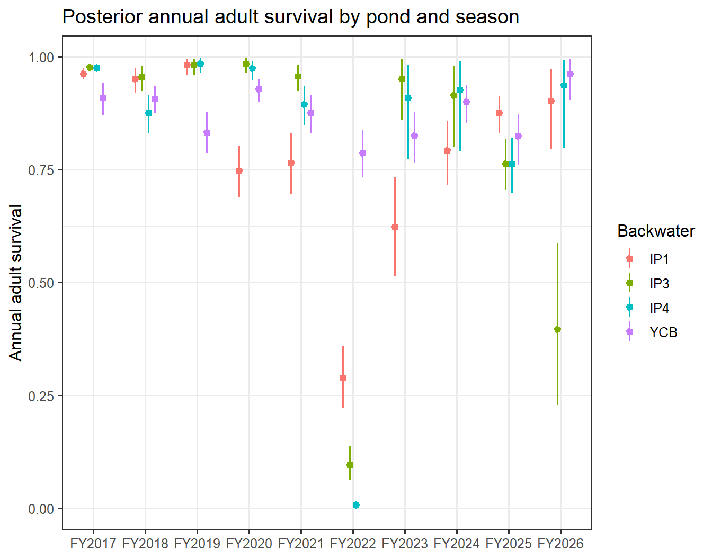

### 2.2 Detection

``` r
det_rows <- expand.grid(pond = 1:NP, stage = c(1, 3)) |> as_tibble() |>
  mutate(node = sprintf("lp[%d, %d]", pond, stage), Stage = if_else(stage == 1, "S/L (shared)", "A")) |>
  left_join(PondTable |> select(pond, Backwater), by = "pond")
det_tbl <- det_rows |> rowwise() |>
  mutate(q = list(qsum(plogis(post[, node])))) |>
  ungroup() |>
  mutate(Mean = map_dbl(q, "mean"), `2.5%` = map_dbl(q, "lwr"), `97.5%` = map_dbl(q, "upr"))
det_tbl |> select(Backwater, Stage, Mean, `2.5%`, `97.5%`) |>
  kable(digits = 3, caption = "Weekly detection probability at mean effort, by pond and stage") |>
  kable_styling(full_width = FALSE, position = "left")
```

| Backwater | Stage        |  Mean |  2.5% | 97.5% |
|:----------|:-------------|------:|------:|------:|
| YCB       | S/L (shared) | 0.458 | 0.446 | 0.469 |
| IP1       | S/L (shared) | 0.204 | 0.190 | 0.217 |
| IP3       | S/L (shared) | 0.074 | 0.058 | 0.091 |
| IP4       | S/L (shared) | 0.593 | 0.562 | 0.624 |
| YCB       | A            | 0.374 | 0.366 | 0.381 |
| IP1       | A            | 0.583 | 0.575 | 0.591 |
| IP3       | A            | 0.302 | 0.295 | 0.309 |
| IP4       | A            | 0.454 | 0.446 | 0.462 |

Weekly detection probability at mean effort, by pond and stage {.table .caption-top .table-sm .table-striped .small}

``` r
tibble(Node = c("g_eff[1]"), Meaning = "Effect of standardized log scan hours on logit detection",
       Mean = mean(post[, "g_eff[1]"]), `2.5%` = quantile(post[, "g_eff[1]"], 0.025), `97.5%` = quantile(post[, "g_eff[1]"], 0.975)) |>
  kable(digits = 3) |> kable_styling(full_width = FALSE, position = "left")
```

| Node | Meaning | Mean | 2.5% | 97.5% |
|:---|:---|---:|---:|---:|
| g_eff\[1\] | Effect of standardized log scan hours on logit detection | 0.414 | 0.401 | 0.428 |

``` r
d_moy_tbl <- tibble(moy = 1:12, node = sprintf("d_moy[1, %d]", 1:12)) |>
  rowwise() |> mutate(mean = mean(post[, node]), lwr = quantile(post[, node], 0.025), upr = quantile(post[, node], 0.975)) |> ungroup()
ggplot(d_moy_tbl, aes(x = factor(moy), y = mean)) +
  geom_pointrange(aes(ymin = lwr, ymax = upr)) +
  labs(x = "Month of season (1 = October)", y = "Logit detection offset (d_moy)", title = "Seasonal (month-of-year) detection offset")
```

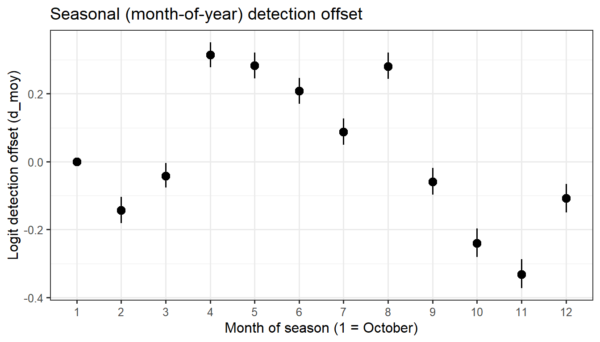

### 2.3 Recruitment

``` r
rec_rows <- list(
  list("a0[1]", "logit pL (fraction \u2265 300 mm) at mean log recruit density", function(x) plogis(x)),
  list("a1[1]", "Change in logit pL per SD of log recruit density", NULL),
  list("mu_r[1]", "Mean log recruits per adult", exp),
  list("sigma_r[1]", "SD of log recruitment rate", NULL),
  list("nu[1]", "Unexplained adult appearances per season", NULL))
rec_tbl <- map_dfr(rec_rows, function(r) {
  x <- post[, r[[1]]]; q <- qsum(x)
  d <- if (is.null(r[[3]])) c(NA, NA, NA) else { dx <- r[[3]](x); c(mean(dx), quantile(dx, c(0.025, 0.975))) }
  tibble(Node = r[[1]], Meaning = r[[2]], Mean = q["mean"], `2.5%` = q["lwr"], `97.5%` = q["upr"],
         `Derived mean` = d[1], `Derived 2.5%` = d[2], `Derived 97.5%` = d[3])
})
rec_tbl |> kable(digits = 3, caption = "Recruitment / size-split hyperparameters") |> kable_styling(full_width = FALSE, position = "left", font_size = 11)
```

| Node | Meaning | Mean | 2.5% | 97.5% | Derived mean | Derived 2.5% | Derived 97.5% |
|:---|:---|---:|---:|---:|---:|---:|---:|
| a0\[1\] | logit pL (fraction ≥ 300 mm) at mean log recruit density | -0.513 | -0.891 | -0.153 | 0.376 | 0.291 | 0.462 |
| a1\[1\] | Change in logit pL per SD of log recruit density | -2.716 | -3.062 | -2.383 | NA | NA | NA |
| mu_r\[1\] | Mean log recruits per adult | -0.092 | -1.139 | 0.872 | 1.034 | 0.320 | 2.391 |
| sigma_r\[1\] | SD of log recruitment rate | 1.860 | 1.137 | 2.777 | NA | NA | NA |
| nu\[1\] | Unexplained adult appearances per season | 4.476 | 3.059 | 6.982 | NA | NA | NA |

Recruitment / size-split hyperparameters {.table .caption-top .table-sm .table-striped .small}

**Caveat (carried from project notes):** `RecJ`/`r`/`U` (latent recruitment and the untagged pool) are weakly identified — point estimates can span two orders of magnitude — and `a1` is a per-SD effect of log recruit *number*, not density per unit area, because pond surface areas are not yet available (`Area = 1` for every pond). Cross-pond comparisons of `a1`/`dens_std` are not yet meaningful for that reason.

``` r
U <- pcol("^U\\[")
untagged_tbl <- expand.grid(pond = 1:NP, season = 1:NS) |> as_tibble() |>
  rowwise() |>
  mutate(Uadult = mean(post[, sprintf("U[%d, %d, 3]", pond, season)]),
         RecJ = if (season < NS) mean(post[, sprintf("RecJ[%d, %d]", pond, season)]) else NA_real_) |>
  ungroup() |> left_join(PondTable |> select(pond, Backwater), by = "pond") |> left_join(season_tbl, by = "season")
untagged_tbl |> select(Backwater, FY, Uadult, RecJ) |>
  kable(digits = 0, caption = "Posterior mean untagged adults and latent juvenile recruitment (RecJ) by pond/season \u2014 treat as nuisance quantities") |>
  kable_styling(full_width = FALSE, position = "left", font_size = 10)
```

| Backwater | FY     | Uadult |    RecJ |
|:----------|:-------|-------:|--------:|
| YCB       | FY2017 |    258 |     539 |
| IP1       | FY2017 |      0 |    2125 |
| IP3       | FY2017 |      0 |     581 |
| IP4       | FY2017 |      0 |     292 |
| YCB       | FY2018 |    269 |     822 |
| IP1       | FY2018 |      4 |     743 |
| IP3       | FY2018 |      4 |      89 |
| IP4       | FY2018 |      4 |     413 |
| YCB       | FY2019 |    235 |    7978 |
| IP1       | FY2019 |     13 |     631 |
| IP3       | FY2019 |     11 |     235 |
| IP4       | FY2019 |     10 |     411 |
| YCB       | FY2020 |    225 |    3497 |
| IP1       | FY2020 |     26 |     229 |
| IP3       | FY2020 |     23 |     281 |
| IP4       | FY2020 |     19 |    1147 |
| YCB       | FY2021 |    245 |    1553 |
| IP1       | FY2021 |    145 |     224 |
| IP3       | FY2021 |     37 |    1507 |
| IP4       | FY2021 |     33 |    2590 |
| YCB       | FY2022 |    193 |   12649 |
| IP1       | FY2022 |    184 |    1160 |
| IP3       | FY2022 |     67 |    2578 |
| IP4       | FY2022 |     41 |     949 |
| YCB       | FY2023 |    145 |     650 |
| IP1       | FY2023 |    107 |    1747 |
| IP3       | FY2023 |     23 |   10661 |
| IP4       | FY2023 |     46 |     651 |
| YCB       | FY2024 |    114 |    2351 |
| IP1       | FY2024 |    163 |    1472 |
| IP3       | FY2024 |   1253 |    6201 |
| IP4       | FY2024 |     59 |     574 |
| YCB       | FY2025 |    181 |    2568 |
| IP1       | FY2025 |    722 |    7382 |
| IP3       | FY2025 |   6798 | 4754099 |
| IP4       | FY2025 |    363 |    1723 |
| YCB       | FY2026 |    145 |      NA |
| IP1       | FY2026 |   1539 |      NA |
| IP3       | FY2026 |   8720 |      NA |
| IP4       | FY2026 |    517 |      NA |

Posterior mean untagged adults and latent juvenile recruitment (RecJ) by pond/season — treat as nuisance quantities {.table .caption-top .table-sm .table-striped .small}

### 2.4 Mortality-event parameters (`dE`)

``` r
de_tbl <- tibble(pond = 1:NP) |> left_join(PondTable |> select(pond, Backwater), by = "pond") |>
  rowwise() |> mutate(x = list(post[, sprintf("dE[%d]", pond)]),
                       has_event = sum(nEvt[pond, ]) > 0,
                       Mean = mean(unlist(x)), `2.5%` = quantile(unlist(x), 0.025), `97.5%` = quantile(unlist(x), 0.975),
                       `Event months (nEvt total)` = sum(nEvt[pond, ])) |>
  ungroup() |> select(Backwater, `Event months (nEvt total)`, has_event, Mean, `2.5%`, `97.5%`)
de_tbl |> kable(digits = 3, caption = "Pond-specific mortality-event offset dE (logit scale, added to phiS/phiL/phiA in flagged months); ponds with no recorded event are prior-only") |>
  kable_styling(full_width = FALSE, position = "left")
```

| Backwater | Event months (nEvt total) | has_event |   Mean |   2.5% |  97.5% |
|:----------|--------------------------:|:----------|-------:|-------:|-------:|
| YCB       |                         0 | FALSE     | -2.406 | -6.823 | -0.092 |
| IP1       |                         3 | TRUE      | -2.555 | -2.905 | -2.203 |
| IP3       |                         4 | TRUE      | -2.630 | -3.069 | -2.181 |
| IP4       |                         4 | TRUE      | -4.159 | -4.696 | -3.662 |

Pond-specific mortality-event offset dE (logit scale, added to phiS/phiL/phiA in flagged months); ponds with no recorded event are prior-only {.table .caption-top .table-sm .table-striped .small}

``` r
de_df <- map_dfr(1:NP, function(p) tibble(Backwater = pond_lab[p], value = post[, sprintf("dE[%d]", p)]))
ggplot(de_df, aes(x = Backwater, y = value)) + geom_violin(fill = "grey85") +
  geom_hline(yintercept = 0, linetype = "dashed") +
  labs(y = "dE (logit offset, event months)", x = NULL, title = "Posterior distribution of the pond-specific die-off offset")
```

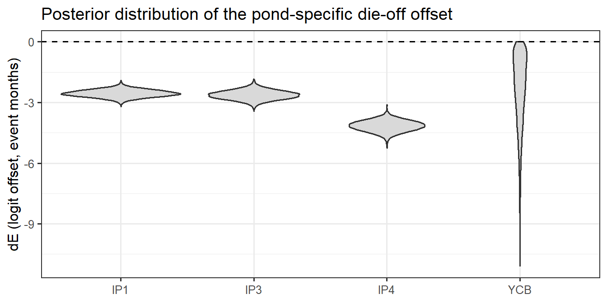

### 2.5 Derived quantities

``` r
gap_span <- function(pond_id, t0, t1) {
  # simple product of season-mean monthly survival over the calendar span (no event/eps decomposition here; see section 5.4)
  s <- Primary$season[t0:(t1 - 1)]
  out <- rep(1, n_draw)
  la <- phiA[, grep(sprintf("^lphiA\\[%d, ", pond_id), colnames(phiA))]
  for (y in unique(s)) out <- out * plogis(la[, y])^sum(s == y)
  out
}
tibble(Quantity = "YCB adult survival Oct 2016 \u2192 Oct 2026 (whole series)",
       Mean = mean(gap_span(1, 1, T_PRIM)), `2.5%` = quantile(gap_span(1, 1, T_PRIM), 0.025), `97.5%` = quantile(gap_span(1, 1, T_PRIM), 0.975)) |>
  kable(digits = 4, caption = "Example multi-season derived survival product") |> kable_styling(full_width = FALSE, position = "left")
```

| Quantity                                              |   Mean |   2.5% |  97.5% |
|:------------------------------------------------------|-------:|-------:|-------:|
| YCB adult survival Oct 2016 → Oct 2026 (whole series) | 0.2578 | 0.2168 | 0.2994 |

Example multi-season derived survival product {.table .caption-top .table-sm .table-striped .small}

## 3. Convergence diagnostics

``` r
fam_tbl <- diag_cur |> filter(!sp2) |>
  group_by(family) |>
  summarise(nodes = n(), `max Rhat` = round(max(rhat, na.rm = TRUE), 3),
            `nodes Rhat>1.05` = sum(rhat > 1.05, na.rm = TRUE),
            `min ESS bulk` = round(min(ess_bulk, na.rm = TRUE)),
            `min ESS tail` = round(min(ess_tail, na.rm = TRUE)),
            `nodes ESS<200` = sum(ess_bulk < 200 | ess_tail < 200, na.rm = TRUE), .groups = "drop") |>
  arrange(desc(`max Rhat`))
fam_tbl |> kable(caption = "R-hat and effective sample size (bulk/tail) by node family, species-1 (XYTE) nodes only") |>
  kable_styling(full_width = FALSE, position = "left", font_size = 11)
```

| family | nodes | max Rhat | nodes Rhat\>1.05 | min ESS bulk | min ESS tail | nodes ESS\<200 |
|:---|---:|---:|---:|---:|---:|---:|
| eps_J | 40 | 1.304 | 19 | 9 | 24 | 21 |
| dJ | 1 | 1.280 | 1 | 10 | 25 | 1 |
| lphiL | 40 | 1.247 | 4 | 10 | 32 | 11 |
| lphiS | 40 | 1.247 | 4 | 10 | 32 | 11 |
| N_tag | 1440 | 1.141 | 30 | 18 | 49 | 485 |
| Tal | 81 | 1.141 | 2 | 18 | 52 | 40 |
| b_post | 3 | 1.092 | 1 | 61 | 196 | 2 |
| Atot | 36 | 1.060 | 2 | 47 | 76 | 2 |
| U | 120 | 1.060 | 2 | 45 | 76 | 3 |
| lphiA | 40 | 1.055 | 1 | 70 | 82 | 14 |
| lpsiLA | 1 | 1.052 | 1 | 67 | 104 | 1 |
| lpsiSL | 1 | 1.038 | 0 | 42 | 66 | 1 |
| RecJ | 36 | 1.033 | 0 | 118 | 106 | 1 |
| r | 36 | 1.033 | 0 | 120 | 104 | 1 |
| sigma_J | 1 | 1.025 | 0 | 286 | 1065 | 0 |
| d_moy | 12 | 1.016 | 0 | 174 | 258 | 7 |
| lp | 12 | 1.014 | 0 | 155 | 189 | 4 |
| U0 | 12 | 1.012 | 0 | 355 | 893 | 0 |
| nu | 1 | 1.011 | 0 | 869 | 3284 | 0 |
| sigma_r | 1 | 1.008 | 0 | 718 | 1376 | 0 |
| mu_r | 1 | 1.007 | 0 | 572 | 1621 | 0 |
| dE | 4 | 1.005 | 0 | 1104 | 2151 | 0 |
| sigma_phi | 1 | 1.004 | 0 | 1437 | 3789 | 0 |
| mu_phi | 1 | 1.002 | 0 | 2353 | 5085 | 0 |
| a0 | 1 | 1.001 | 0 | 4227 | 5202 | 0 |
| a1 | 1 | 1.001 | 0 | 4897 | 5335 | 0 |
| pLg | 40 | 1.001 | 0 | 3988 | 5071 | 0 |
| dS | 1 | 1.000 | 0 | 3346 | 3304 | 0 |
| g_eff | 1 | 1.000 | 0 | 2831 | 3854 | 0 |

R-hat and effective sample size (bulk/tail) by node family, species-1 (XYTE) nodes only {.table .caption-top .table-sm .table-striped .small}

``` r
flagged <- diag_cur |> filter(!sp2, rhat > 1.05 | ess_bulk < 200 | ess_tail < 200) |>
  mutate(is_abund_note = if_else(is_abund, "N_tag/U/RecJ/r/Tal/Atot \u2014 often pinned near-exactly by the known-alive constraint; high R-hat here can be a floating-point artifact of near-zero within-chain variance rather than a real mixing problem", "")) |>
  arrange(desc(rhat))
cat(sprintf("**%d of %d** species-1 nodes are flagged (R-hat > 1.05 or ESS bulk/tail < 200); %d of those are abundance/recruitment nodes (`N_tag`/`U`/`RecJ`/`r`/`Tal`/`Atot`).\n\n",
            nrow(flagged), sum(!diag_cur$sp2), sum(flagged$is_abund)))
```

    **605 of 2005** species-1 nodes are flagged (R-hat > 1.05 or ESS bulk/tail < 200); 532 of those are abundance/recruitment nodes (`N_tag`/`U`/`RecJ`/`r`/`Tal`/`Atot`).

``` r
flagged |> filter(!is_abund) |> select(variable, mean, rhat, ess_bulk, ess_tail) |>
  kable(digits = c(0, 3, 3, 0, 0), caption = "Flagged nodes, excluding abundance/recruitment (the rest are listed in the table above by family)") |>
  kable_styling(full_width = FALSE, position = "left", font_size = 10)
```

| variable       |   mean |  rhat | ess_bulk | ess_tail |
|:---------------|-------:|------:|---------:|---------:|
| eps_J\[1, 10\] |  6.426 | 1.304 |        9 |       27 |
| dJ\[1\]        | -1.803 | 1.280 |       10 |       25 |
| eps_J\[1, 3\]  |  0.004 | 1.265 |       10 |       24 |
| lphiS\[1, 10\] | 10.552 | 1.247 |       10 |       32 |
| lphiL\[1, 10\] | 10.558 | 1.247 |       10 |       32 |
| eps_J\[3, 9\]  |  1.622 | 1.204 |       13 |       27 |
| eps_J\[1, 9\]  | -0.414 | 1.177 |       14 |       51 |
| eps_J\[1, 8\]  | -0.537 | 1.161 |       15 |       55 |
| eps_J\[1, 1\]  | -2.115 | 1.145 |       18 |       43 |
| lphiS\[2, 2\]  | -2.760 | 1.138 |       18 |       65 |
| lphiL\[2, 2\]  | -2.753 | 1.138 |       18 |       69 |
| eps_J\[1, 6\]  | -0.336 | 1.138 |       17 |       76 |
| eps_J\[4, 9\]  |  1.720 | 1.134 |       19 |       50 |
| eps_J\[2, 5\]  |  0.220 | 1.133 |       17 |       83 |
| eps_J\[1, 2\]  | -0.540 | 1.133 |       17 |      197 |
| eps_J\[1, 7\]  | -1.201 | 1.126 |       22 |      101 |
| eps_J\[2, 2\]  | -6.456 | 1.118 |       21 |      116 |
| eps_J\[2, 6\]  |  3.133 | 1.112 |       20 |      109 |
| eps_J\[2, 9\]  |  1.119 | 1.099 |       28 |       98 |
| eps_J\[2, 3\]  | -2.591 | 1.099 |       31 |      128 |
| eps_J\[1, 5\]  | -2.078 | 1.096 |       30 |      154 |
| b_post\[1, 2\] | -1.392 | 1.092 |       80 |      196 |
| lphiS\[1, 3\]  |  2.377 | 1.084 |       87 |      327 |
| lphiL\[1, 3\]  |  2.384 | 1.084 |       88 |      322 |
| eps_J\[2, 7\]  |  1.549 | 1.070 |       54 |      282 |
| eps_J\[2, 4\]  |  2.163 | 1.067 |       43 |      185 |
| lphiS\[1, 9\]  |  1.904 | 1.066 |       56 |      374 |
| lphiL\[1, 9\]  |  1.910 | 1.066 |       57 |      385 |
| lphiA\[1, 3\]  |  4.184 | 1.055 |      111 |      278 |
| lpsiLA\[1\]    | -2.401 | 1.052 |       67 |      104 |
| eps_J\[2, 8\]  |  2.162 | 1.051 |       73 |      357 |
| lphiS\[1, 8\]  |  2.408 | 1.047 |      151 |      473 |
| lphiL\[1, 8\]  |  2.415 | 1.047 |      152 |      475 |
| lphiS\[1, 7\]  |  1.125 | 1.044 |      137 |      509 |
| lphiL\[1, 7\]  |  1.131 | 1.043 |      138 |      533 |
| lphiA\[2, 3\]  |  6.542 | 1.040 |       79 |       82 |
| b_post\[1, 1\] | -2.993 | 1.039 |       61 |      211 |
| lpsiSL\[1\]    | -1.314 | 1.038 |       42 |       66 |
| lphiA\[3, 9\]  |  3.789 | 1.036 |       70 |      218 |
| eps_J\[2, 1\]  |  0.100 | 1.032 |      136 |      345 |
| lphiS\[4, 6\]  |  4.526 | 1.031 |      138 |      495 |
| lphiL\[4, 6\]  |  4.532 | 1.031 |      139 |      499 |
| lphiS\[1, 5\]  |  0.622 | 1.030 |      164 |      116 |
| lphiL\[1, 5\]  |  0.628 | 1.030 |      165 |      116 |
| lphiA\[1, 9\]  |  4.128 | 1.028 |      122 |      240 |
| lphiS\[3, 9\]  |  3.601 | 1.028 |       96 |      348 |
| lphiL\[3, 9\]  |  3.607 | 1.028 |       95 |      360 |
| eps_J\[1, 4\]  |  0.791 | 1.028 |      139 |      549 |
| lphiA\[4, 1\]  |  6.165 | 1.027 |      101 |      385 |
| lphiA\[4, 9\]  |  3.783 | 1.027 |       83 |      237 |
| lphiL\[1, 1\]  |  0.931 | 1.026 |      192 |      786 |
| lphiS\[1, 1\]  |  0.924 | 1.026 |      192 |      792 |
| lphiA\[2, 1\]  |  5.759 | 1.024 |       91 |      350 |
| lphiA\[3, 1\]  |  6.231 | 1.024 |      100 |      374 |
| lphiS\[4, 9\]  |  3.693 | 1.023 |      108 |      413 |
| lphiL\[4, 9\]  |  3.699 | 1.023 |      108 |      409 |
| lphiA\[1, 1\]  |  4.849 | 1.021 |      140 |      328 |
| d_moy\[1, 10\] | -0.240 | 1.016 |      174 |      307 |
| lp\[2, 3\]     |  0.337 | 1.014 |      156 |      237 |
| lp\[1, 3\]     | -0.517 | 1.012 |      155 |      189 |
| lphiA\[1, 10\] |  5.935 | 1.010 |      182 |      161 |
| lphiA\[1, 8\]  |  4.754 | 1.010 |      171 |      258 |
| lphiA\[2, 9\]  |  4.509 | 1.010 |      166 |      516 |
| lp\[3, 3\]     | -0.838 | 1.010 |      158 |      219 |
| lp\[4, 3\]     | -0.183 | 1.009 |      169 |      269 |
| d_moy\[1, 5\]  |  0.283 | 1.009 |      193 |      405 |
| d_moy\[1, 6\]  |  0.209 | 1.009 |      196 |      319 |
| lphiA\[1, 7\]  |  4.136 | 1.009 |      154 |      458 |
| d_moy\[1, 11\] | -0.331 | 1.009 |      195 |      282 |
| lphiA\[1, 4\]  |  5.087 | 1.008 |      158 |      530 |
| d_moy\[1, 2\]  | -0.143 | 1.008 |      175 |      320 |
| d_moy\[1, 9\]  | -0.059 | 1.007 |      189 |      318 |
| d_moy\[1, 4\]  |  0.314 | 1.006 |      194 |      349 |

Flagged nodes, excluding abundance/recruitment (the rest are listed in the table above by family) {.table .caption-top .table-sm .table-striped .small}

``` r
diag_cur |> filter(!sp2) |>
  ggplot(aes(x = pmin(ess_bulk, ess_tail), y = rhat)) +
  geom_hline(yintercept = c(1.05, 1.1), linetype = "dashed", colour = "grey50") +
  geom_vline(xintercept = 200, linetype = "dashed", colour = "grey50") +
  geom_point(aes(colour = is_abund), alpha = 0.5) +
  scale_x_log10() +
  scale_colour_manual(values = c("black", "steelblue"), labels = c("parameters", "abundance / recruitment"), name = NULL) +
  labs(x = "min(ESS bulk, ESS tail), log scale", y = "R-hat", title = "Convergence of all monitored species-1 nodes")
```

    Warning: Removed 267 rows containing missing values or values outside the scale range
    (`geom_point()`).

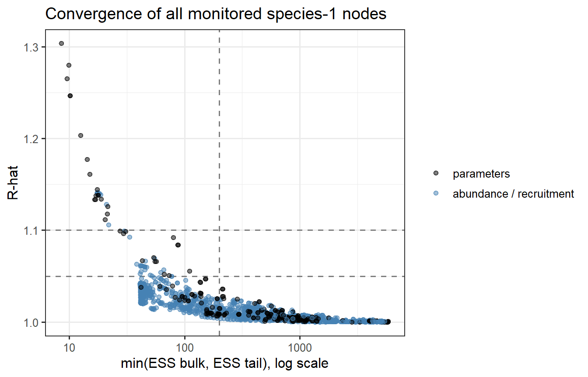

## 4. Trace plots

Inline trace plots for the core parameters (survival, detection, recruitment, `eps_J`, event terms). Full traceplots for every monitored node are in model/YCB3S_traceplots_xyte_m12.pdf.

``` r
trace_plot <- function(vars, ncol = 3) {
  df <- as_draws_df(draws_cur) |> select(all_of(vars), .chain, .iteration) |>
    pivot_longer(all_of(vars), names_to = "parameter", values_to = "value")
  ggplot(df, aes(x = .iteration, y = value, colour = factor(.chain))) +
    geom_line(alpha = 0.6, linewidth = 0.3) +
    facet_wrap(~parameter, scales = "free_y", ncol = ncol) +
    labs(colour = "Chain", x = "Iteration (post-thin)", y = NULL) +
    theme(legend.position = "bottom")
}
```

### 4.1 Survival

``` r
trace_plot(c("mu_phi[1]", "sigma_phi[1]", "dJ[1]", "dS[1]", "sigma_J[1]", "b_post[1, 1]", "b_post[1, 2]", "lpsiSL[1]", "lpsiLA[1]"))
```

    Warning: Dropping 'draws_df' class as required metadata was removed.

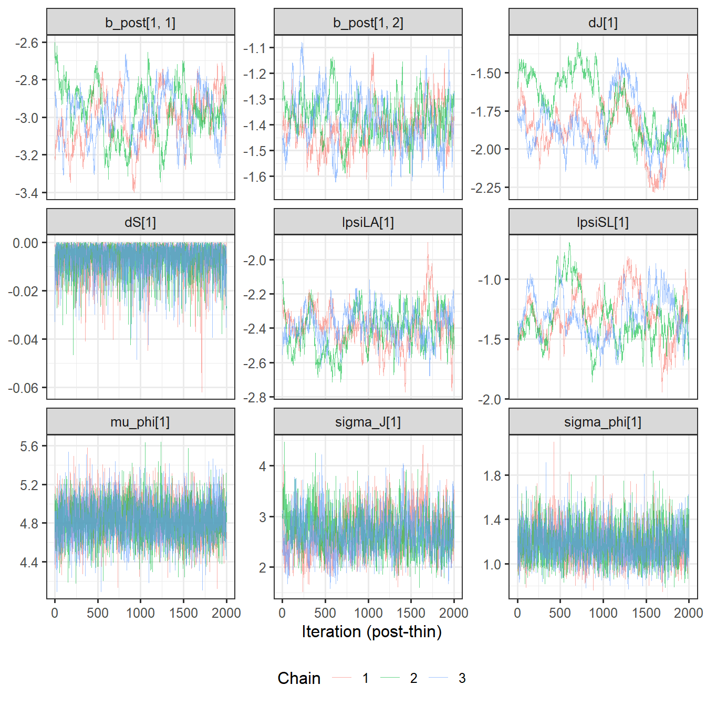

### 4.2 Detection

``` r
trace_plot(c(sprintf("lp[%d, 1]", 1:NP), sprintf("lp[%d, 3]", 1:NP), "g_eff[1]"))
```

    Warning: Dropping 'draws_df' class as required metadata was removed.

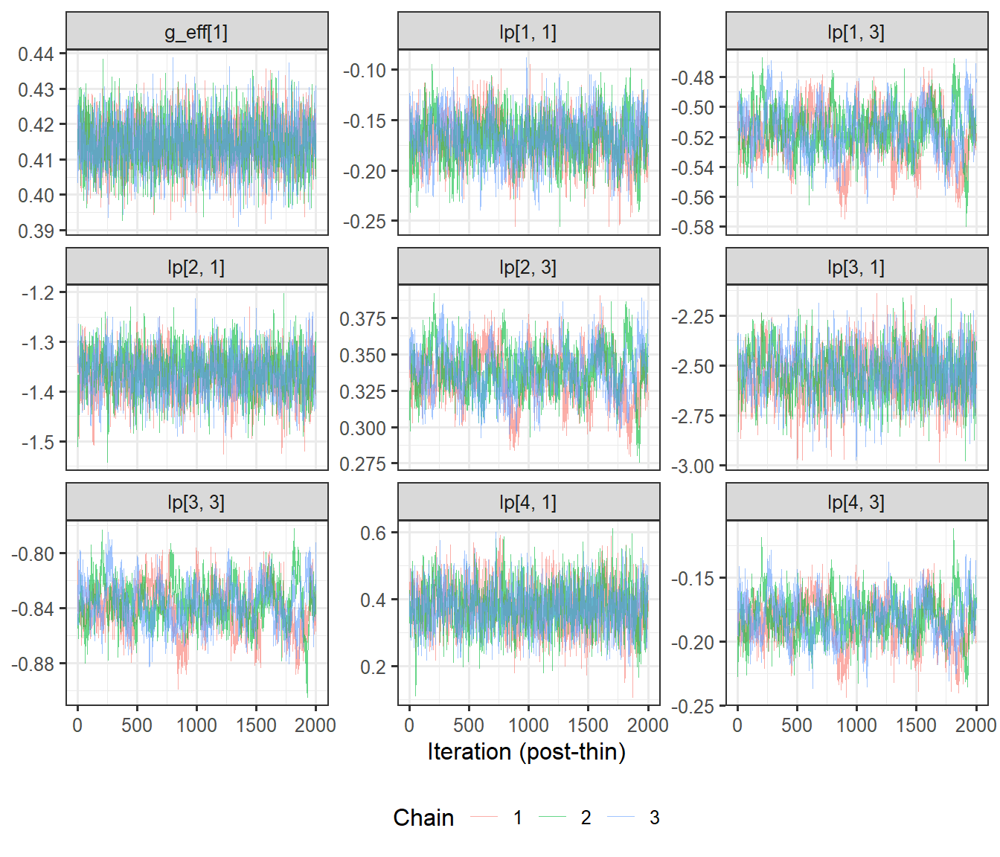

### 4.3 Recruitment

``` r
trace_plot(c("a0[1]", "a1[1]", "mu_r[1]", "sigma_r[1]", "nu[1]"))
```

    Warning: Dropping 'draws_df' class as required metadata was removed.

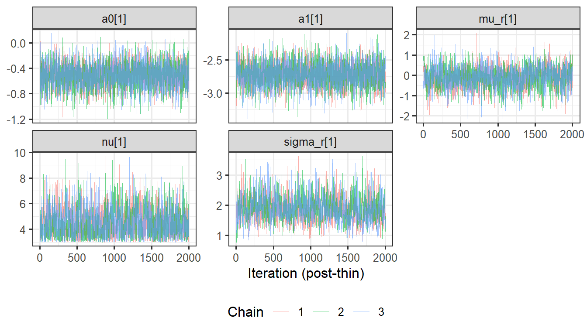

### 4.4 Season juvenile deviations (`eps_J`)

``` r
trace_plot(c(sprintf("eps_J[1, %d]", 1:NS), sprintf("eps_J[2, %d]", 1:NS)), ncol = 5)
```

    Warning: Dropping 'draws_df' class as required metadata was removed.

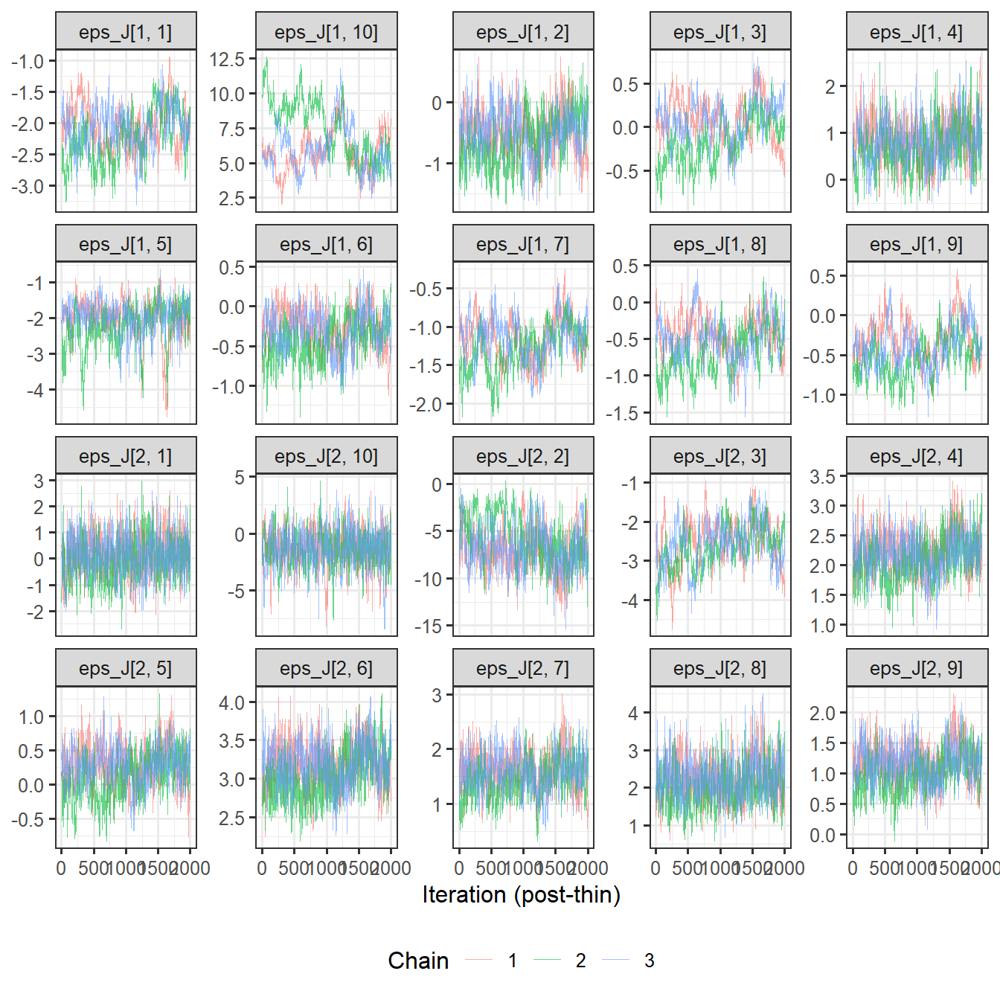

YCB (pond 1) and IP1 (pond 2) are shown because they are the only ponds with substantial netting-tagged juvenile cohorts; IP3/IP4 `eps_J` are largely prior-driven.

### 4.5 Mortality-event terms (`dE`)

``` r
trace_plot(sprintf("dE[%d]", 1:NP), ncol = 2)
```

    Warning: Dropping 'draws_df' class as required metadata was removed.

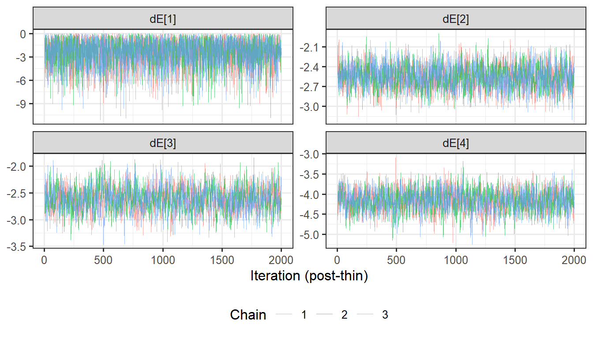

## 5. Posterior predictive checks

### 5.1 Netting join

``` r
ntag_stage <- function(pond_id, stage_id) pcol(sprintf("^N_tag\\[%d, [0-9]+, %d\\]$", pond_id, stage_id))
u_stage <- function(pond_id, stage_id) pcol(sprintf("^U\\[%d, [0-9]+, %d\\]$", pond_id, stage_id))
set.seed(9231)
net_pp <- map_dfr(seq_len(nrow(Netting)), function(i) {
  r <- Netting[i, ]
  Tal <- ntag_stage(r$pond, r$stage)[, r$t_e]
  Uav <- pmax(0, u_stage(r$pond, r$stage)[, r$season] - r$remU_before)
  pm <- (Tal + 1e-9) / (Tal + Uav + 2e-9)
  sim <- rbinom(n_draw, r$n, pm)
  tibble(Backwater = pond_lab[r$pond], EventMonth = r$EventMonth, season = r$season, stage = stage_lab[r$stage],
         n = r$n, m_obs = r$m, pm_mean = mean(pm), pp_lwr = quantile(sim, 0.025), pp_med = median(sim), pp_upr = quantile(sim, 0.975),
         p_tail = min(1, 2 * min(mean(sim <= r$m), mean(sim >= r$m))))
})
net_pp |> select(Backwater, EventMonth, stage, n, m_obs, pm_mean, pp_lwr, pp_upr, p_tail) |>
  kable(digits = c(0,0,0,0,0,3,0,0,3), caption = "Netting events: tagged fish among those handled vs posterior predictive distribution") |>
  kable_styling(full_width = FALSE, position = "left", font_size = 10)
```

| Backwater | EventMonth | stage          |    n | m_obs | pm_mean | pp_lwr | pp_upr | p_tail |
|:----------|:-----------|:---------------|-----:|------:|--------:|-------:|-------:|-------:|
| YCB       | 2016-10-01 | S (\< 300 mm)  |   85 |     0 |   0.000 |      0 |      0 |  1.000 |
| YCB       | 2016-10-01 | L (300–349 mm) |   35 |     0 |   0.000 |      0 |      0 |  1.000 |
| YCB       | 2016-10-01 | A (≥ 350 mm)   |   27 |    14 |   0.326 |      4 |     15 |  0.113 |
| YCB       | 2017-05-01 | S (\< 300 mm)  |    3 |     0 |   0.000 |      0 |      0 |  1.000 |
| YCB       | 2017-05-01 | A (≥ 350 mm)   |   16 |     9 |   0.472 |      3 |     12 |  0.672 |
| YCB       | 2017-10-01 | S (\< 300 mm)  |   34 |     0 |   0.000 |      0 |      0 |  1.000 |
| YCB       | 2017-10-01 | L (300–349 mm) |    6 |     0 |   0.001 |      0 |      0 |  1.000 |
| YCB       | 2017-10-01 | A (≥ 350 mm)   |   93 |    36 |   0.458 |     31 |     54 |  0.303 |
| YCB       | 2018-10-01 | S (\< 300 mm)  |  484 |     0 |   0.000 |      0 |      1 |  1.000 |
| YCB       | 2018-10-01 | A (≥ 350 mm)   |   38 |    23 |   0.526 |     14 |     26 |  0.442 |
| YCB       | 2019-11-01 | S (\< 300 mm)  | 2877 |     0 |   0.000 |      0 |      0 |  1.000 |
| YCB       | 2019-11-01 | L (300–349 mm) |   10 |     0 |   0.004 |      0 |      1 |  1.000 |
| YCB       | 2019-11-01 | A (≥ 350 mm)   |   79 |    37 |   0.507 |     30 |     50 |  0.621 |
| YCB       | 2020-11-01 | S (\< 300 mm)  |  228 |     0 |   0.000 |      0 |      0 |  1.000 |
| YCB       | 2020-11-01 | L (300–349 mm) |    2 |     0 |   0.002 |      0 |      0 |  1.000 |
| YCB       | 2020-11-01 | A (≥ 350 mm)   |  112 |    56 |   0.481 |     41 |     67 |  0.809 |
| YCB       | 2021-10-01 | S (\< 300 mm)  |  244 |     0 |   0.000 |      0 |      0 |  1.000 |
| YCB       | 2021-10-01 | L (300–349 mm) |    1 |     0 |   0.017 |      0 |      0 |  1.000 |
| YCB       | 2021-10-01 | A (≥ 350 mm)   |   65 |    40 |   0.556 |     27 |     45 |  0.483 |
| YCB       | 2022-11-01 | S (\< 300 mm)  |  282 |     0 |   0.000 |      0 |      0 |  1.000 |
| YCB       | 2022-11-01 | L (300–349 mm) |    2 |     1 |   0.031 |      0 |      1 |  0.123 |
| YCB       | 2022-11-01 | A (≥ 350 mm)   |   44 |    25 |   0.573 |     18 |     33 |  1.000 |
| YCB       | 2023-11-01 | S (\< 300 mm)  |  340 |     0 |   0.000 |      0 |      0 |  1.000 |
| YCB       | 2023-11-01 | L (300–349 mm) |   26 |     0 |   0.003 |      0 |      1 |  1.000 |
| YCB       | 2023-11-01 | A (≥ 350 mm)   |   20 |    13 |   0.596 |      7 |     16 |  0.801 |
| YCB       | 2024-10-01 | S (\< 300 mm)  |  827 |     1 |   0.002 |      0 |      6 |  1.000 |
| YCB       | 2024-10-01 | L (300–349 mm) |    4 |     1 |   0.103 |      0 |      2 |  0.658 |
| YCB       | 2024-10-01 | A (≥ 350 mm)   |   66 |    26 |   0.476 |     22 |     42 |  0.342 |
| YCB       | 2025-10-01 | L (300–349 mm) |    7 |     0 |   0.002 |      0 |      0 |  1.000 |
| YCB       | 2025-10-01 | A (≥ 350 mm)   |   50 |    25 |   0.487 |     16 |     33 |  0.972 |
| IP1       | 2017-11-01 | A (≥ 350 mm)   |   36 |    34 |   0.978 |     33 |     36 |  0.375 |
| IP1       | 2018-02-01 | A (≥ 350 mm)   |   18 |    17 |   0.988 |     17 |     18 |  0.401 |
| IP1       | 2018-03-01 | A (≥ 350 mm)   |   13 |    13 |   0.993 |     12 |     13 |  1.000 |
| IP1       | 2018-12-01 | S (\< 300 mm)  |   55 |     0 |   0.000 |      0 |      0 |  1.000 |
| IP1       | 2018-12-01 | L (300–349 mm) |   16 |     0 |   0.000 |      0 |      0 |  1.000 |
| IP1       | 2018-12-01 | A (≥ 350 mm)   |    9 |     9 |   0.945 |      6 |      9 |  1.000 |
| IP1       | 2019-01-01 | S (\< 300 mm)  |   19 |     2 |   0.064 |      0 |      4 |  0.656 |
| IP1       | 2019-01-01 | L (300–349 mm) |    2 |     0 |   0.266 |      0 |      2 |  1.000 |
| IP1       | 2019-01-01 | A (≥ 350 mm)   |    5 |     5 |   0.945 |      3 |      5 |  1.000 |
| IP1       | 2019-02-01 | S (\< 300 mm)  |   42 |     7 |   0.058 |      0 |      7 |  0.084 |
| IP1       | 2019-02-01 | L (300–349 mm) |   16 |     4 |   0.283 |      1 |      9 |  1.000 |
| IP1       | 2019-02-01 | A (≥ 350 mm)   |    5 |     4 |   0.945 |      3 |      5 |  0.427 |
| IP1       | 2019-12-01 | S (\< 300 mm)  |   50 |     0 |   0.002 |      0 |      1 |  1.000 |
| IP1       | 2019-12-01 | L (300–349 mm) |    2 |     0 |   0.021 |      0 |      1 |  1.000 |
| IP1       | 2019-12-01 | A (≥ 350 mm)   |    9 |     6 |   0.890 |      5 |      9 |  0.173 |
| IP1       | 2020-12-01 | S (\< 300 mm)  |   34 |     0 |   0.014 |      0 |      3 |  1.000 |
| IP1       | 2020-12-01 | L (300–349 mm) |   17 |     2 |   0.049 |      0 |      3 |  0.408 |
| IP1       | 2020-12-01 | A (≥ 350 mm)   |   32 |    12 |   0.519 |     10 |     23 |  0.204 |
| IP1       | 2021-12-01 | S (\< 300 mm)  |   38 |     0 |   0.002 |      0 |      1 |  1.000 |
| IP1       | 2021-12-01 | L (300–349 mm) |    9 |     2 |   0.056 |      0 |      2 |  0.194 |
| IP1       | 2021-12-01 | A (≥ 350 mm)   |   19 |     8 |   0.420 |      3 |     13 |  1.000 |
| IP1       | 2022-03-01 | S (\< 300 mm)  |   28 |     4 |   0.131 |      0 |      9 |  0.940 |
| IP1       | 2022-03-01 | L (300–349 mm) |    3 |     0 |   0.181 |      0 |      2 |  1.000 |
| IP1       | 2022-03-01 | A (≥ 350 mm)   |    9 |     4 |   0.451 |      1 |      7 |  1.000 |
| IP1       | 2022-12-01 | S (\< 300 mm)  |   47 |     0 |   0.004 |      0 |      2 |  1.000 |
| IP1       | 2022-12-01 | L (300–349 mm) |    5 |     2 |   0.070 |      0 |      2 |  0.095 |
| IP1       | 2022-12-01 | A (≥ 350 mm)   |   21 |     9 |   0.326 |      2 |     12 |  0.493 |
| IP1       | 2023-11-01 | S (\< 300 mm)  |   13 |     0 |   0.005 |      0 |      1 |  1.000 |
| IP1       | 2023-11-01 | L (300–349 mm) |    4 |     0 |   0.013 |      0 |      1 |  1.000 |
| IP1       | 2023-11-01 | A (≥ 350 mm)   |   43 |     9 |   0.292 |      6 |     20 |  0.441 |
| IP3       | 2017-11-01 | A (≥ 350 mm)   |   29 |    29 |   0.981 |     27 |     29 |  1.000 |
| IP3       | 2018-03-01 | A (≥ 350 mm)   |    2 |     2 |   0.981 |      1 |      2 |  1.000 |
| IP3       | 2018-12-01 | L (300–349 mm) |    1 |     0 |   0.000 |      0 |      0 |  1.000 |
| IP3       | 2018-12-01 | A (≥ 350 mm)   |    7 |     7 |   0.951 |      5 |      7 |  1.000 |
| IP3       | 2019-12-01 | A (≥ 350 mm)   |    8 |     8 |   0.905 |      5 |      8 |  0.927 |
| IP3       | 2020-12-01 | S (\< 300 mm)  |    2 |     0 |   0.000 |      0 |      0 |  1.000 |
| IP3       | 2020-12-01 | L (300–349 mm) |    1 |     0 |   0.000 |      0 |      0 |  1.000 |
| IP3       | 2020-12-01 | A (≥ 350 mm)   |   15 |    15 |   0.855 |      9 |     15 |  0.235 |
| IP3       | 2021-12-01 | A (≥ 350 mm)   |   10 |     8 |   0.767 |      4 |     10 |  1.000 |
| IP3       | 2022-11-01 | A (≥ 350 mm)   |    1 |     1 |   0.645 |      0 |      1 |  1.000 |
| IP3       | 2023-11-01 | S (\< 300 mm)  |    1 |     0 |   0.000 |      0 |      0 |  1.000 |
| IP4       | 2017-11-01 | A (≥ 350 mm)   |   23 |    23 |   0.980 |     21 |     23 |  1.000 |
| IP4       | 2018-03-01 | A (≥ 350 mm)   |   19 |    18 |   0.980 |     17 |     19 |  0.645 |
| IP4       | 2018-12-01 | A (≥ 350 mm)   |   17 |    17 |   0.950 |     14 |     17 |  0.889 |
| IP4       | 2019-12-01 | A (≥ 350 mm)   |   15 |    15 |   0.912 |     11 |     15 |  0.538 |
| IP4       | 2020-12-01 | A (≥ 350 mm)   |   10 |     9 |   0.858 |      6 |     10 |  1.000 |
| IP4       | 2022-02-01 | A (≥ 350 mm)   |   12 |    11 |   0.812 |      6 |     12 |  0.712 |
| IP4       | 2022-11-01 | L (300–349 mm) |    1 |     0 |   0.000 |      0 |      0 |  1.000 |
| IP4       | 2022-11-01 | A (≥ 350 mm)   |    5 |     0 |   0.194 |      0 |      4 |  0.857 |
| IP4       | 2023-12-01 | L (300–349 mm) |    1 |     0 |   0.000 |      0 |      0 |  1.000 |
| IP4       | 2023-12-01 | A (≥ 350 mm)   |    3 |     1 |   0.260 |      0 |      3 |  1.000 |

Netting events: tagged fish among those handled vs posterior predictive distribution {.table .caption-top .table-sm .table-striped .small}

``` r
net_pp |> filter(n >= 5) |>
  ggplot(aes(x = EventMonth)) +
  geom_linerange(aes(ymin = pp_lwr / n, ymax = pp_upr / n), colour = "steelblue", linewidth = 1.5, alpha = 0.6) +
  geom_point(aes(y = pm_mean), colour = "steelblue", size = 1.8) +
  geom_point(aes(y = m_obs / n), shape = 4, size = 2.5, stroke = 1) +
  facet_grid(stage ~ Backwater, scales = "free_x") +
  labs(x = NULL, y = "Fraction previously tagged", title = "Netting join PPC (events with \u2265 5 fish handled): blue = posterior predictive, \u00d7 = observed") +
  theme(axis.text.x = element_text(angle = 45, hjust = 1, size = 7))
```

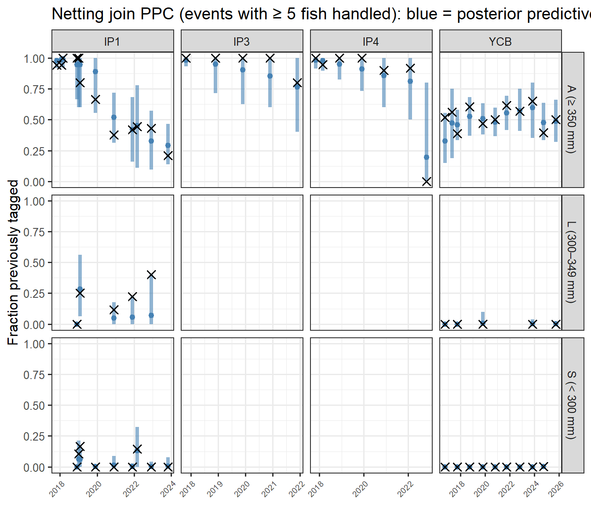

``` r
cat(sprintf("**%d of %d** event-stage rows have a two-sided posterior predictive p-value < 0.05 (**%d of %d** adult rows).\n",
            sum(net_pp$p_tail < 0.05), nrow(net_pp), sum(net_pp$p_tail < 0.05 & grepl("^A", net_pp$stage)), sum(grepl("^A", net_pp$stage))))
```

    **0 of 81** event-stage rows have a two-sided posterior predictive p-value < 0.05 (**0 of 38** adult rows).

### 5.2 Recruit size-split predictions

``` r
pLg <- pcol("^pLg\\[")
set.seed(4417)
split_pp <- map_dfr(seq_len(nrow(SplitObs)), function(i) {
  r <- SplitObs[i, ]
  p <- pLg[, sprintf("pLg[%d, %d]", r$pond, r$season)]
  sim <- rbinom(n_draw, r$n0, p)
  tibble(Backwater = pond_lab[r$pond], season = r$season, n0 = r$n0, nL_obs = r$nL, pL_obs = r$nL / r$n0,
         pLg_mean = mean(p), pp_lwr = quantile(sim, 0.025), pp_upr = quantile(sim, 0.975),
         p_tail = min(1, 2 * min(mean(sim <= r$nL), mean(sim >= r$nL))))
}) |> left_join(season_tbl, by = "season")
split_pp |> select(Backwater, FY, n0, nL_obs, pL_obs, pLg_mean, pp_lwr, pp_upr, p_tail) |>
  kable(digits = 3, caption = "Recruit size split: observed vs posterior predictive (two-sided PP p-value; small = misfit)") |>
  kable_styling(full_width = FALSE, position = "left", font_size = 10)
```

| Backwater | FY     |   n0 | nL_obs | pL_obs | pLg_mean | pp_lwr | pp_upr | p_tail |
|:----------|:-------|-----:|-------:|-------:|---------:|-------:|-------:|-------:|
| YCB       | FY2018 |   40 |      6 |  0.150 |    0.181 |      3 |     13 |  0.796 |
| YCB       | FY2019 |  484 |      0 |  0.000 |    0.017 |      3 |     15 |  0.002 |
| YCB       | FY2020 | 2887 |     10 |  0.003 |    0.003 |      2 |     15 |  0.593 |
| YCB       | FY2021 |  230 |      2 |  0.009 |    0.036 |      3 |     14 |  0.027 |
| YCB       | FY2022 |  245 |      1 |  0.004 |    0.033 |      3 |     15 |  0.006 |
| YCB       | FY2023 |  283 |      1 |  0.004 |    0.006 |      0 |      5 |  0.963 |
| YCB       | FY2024 |  366 |     26 |  0.071 |    0.022 |      3 |     14 |  0.000 |
| YCB       | FY2025 |  829 |      3 |  0.004 |    0.010 |      3 |     15 |  0.100 |
| YCB       | FY2026 |    7 |      7 |  1.000 |    0.544 |      1 |      6 |  0.039 |
| IP1       | FY2019 |   70 |     16 |  0.229 |    0.110 |      3 |     13 |  0.008 |
| IP1       | FY2020 |   52 |      2 |  0.038 |    0.145 |      3 |     13 |  0.035 |
| IP1       | FY2021 |   49 |     15 |  0.306 |    0.153 |      3 |     13 |  0.013 |
| IP1       | FY2022 |   45 |      7 |  0.156 |    0.164 |      3 |     13 |  1.000 |
| IP1       | FY2023 |   50 |      3 |  0.060 |    0.150 |      3 |     13 |  0.113 |
| IP1       | FY2024 |   17 |      4 |  0.235 |    0.342 |      2 |     10 |  0.520 |
| IP3       | FY2019 |    1 |      1 |  1.000 |    0.830 |      0 |      1 |  1.000 |
| IP3       | FY2021 |    3 |      1 |  0.333 |    0.708 |      0 |      3 |  0.428 |
| IP3       | FY2024 |    1 |      0 |  0.000 |    0.830 |      0 |      1 |  0.351 |
| IP4       | FY2023 |    1 |      1 |  1.000 |    0.830 |      0 |      1 |  1.000 |
| IP4       | FY2024 |    1 |      1 |  1.000 |    0.830 |      0 |      1 |  1.000 |

Recruit size split: observed vs posterior predictive (two-sided PP p-value; small = misfit) {.table .caption-top .table-sm .table-striped .small}

``` r
cat(sprintf("**%d of %d** pond-seasons have a posterior predictive p-value < 0.05.\n", sum(split_pp$p_tail < 0.05), nrow(split_pp)))
```

    **8 of 20** pond-seasons have a posterior predictive p-value < 0.05.

``` r
ggplot(split_pp, aes(x = FY)) +
  geom_linerange(aes(ymin = pp_lwr / n0, ymax = pp_upr / n0), colour = "steelblue", linewidth = 1.5, alpha = 0.6) +
  geom_point(aes(y = pLg_mean), colour = "steelblue", size = 1.8) +
  geom_point(aes(y = pL_obs), shape = 4, size = 2.5, stroke = 1) +
  facet_wrap(~Backwater, ncol = 1) +
  labs(x = NULL, y = "Fraction of recruits \u2265 300 mm", title = "Recruit size-split PPC by pond")
```

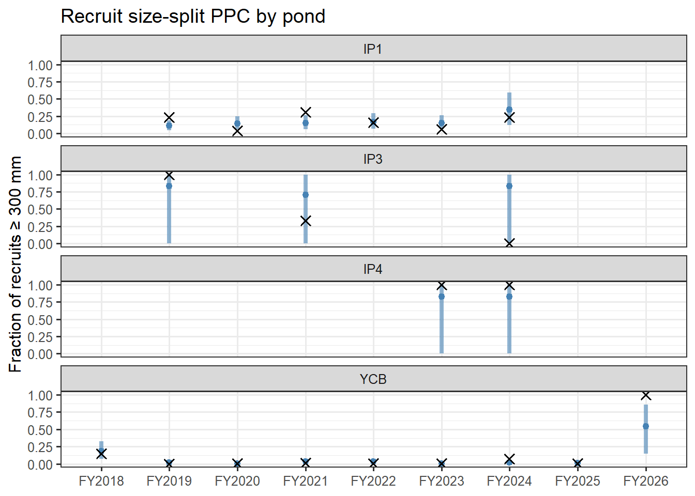

### 5.3 Detection vs effort

Weekly detection among fish already established as adults (stage A by entry or by a prior netting measurement), aggregated by pond-month, compared to the posterior-mean model curve `logit(p) = lp[pond,3] + g_eff·eff_std + d_moy[month-of-season]`.

``` r
adult_mask <- function(pond_id) {
  fi <- which(Fish$pond == pond_id)
  st <- stobs_mat[fi, , drop = FALSE]
  cumA <- t(apply(st == 3, 1, cumsum)) > 0
  mask <- cumA | (Fish$stage0[fi] == 3)
  list(fi = fi, mask = mask, ent = Fish$entry_t[fi], endt = Fish$end_t[fi], cf = Fish$count_from[fi])
}
lp_mean <- sapply(1:NP, function(p) mean(post[, sprintf("lp[%d, 3]", p)]))
g_mean <- mean(post[, "g_eff[1]"])
dmoy_mean <- sapply(1:12, function(m) mean(post[, sprintf("d_moy[1, %d]", m)]))
det_eff_tbl <- map_dfr(1:NP, function(p) {
  am <- adult_mask(p); Tn <- ncol(am$mask)
  avail <- t(sapply(seq_along(am$fi), function(i) am$ent[i] <= seq_len(Tn) & am$endt[i] >= seq_len(Tn) & am$cf[i] <= seq_len(Tn))) & am$mask
  Ksub <- K_mat[am$fi, , drop = FALSE] * avail
  Ysub <- pmin(y_mat[am$fi, , drop = FALSE], K_mat[am$fi, , drop = FALSE]) * avail
  tibble(pond = p, t = seq_len(Tn), K = colSums(Ksub), y = colSums(Ysub), eff_std = eff_std[p, ])
}) |> filter(K > 0) |>
  left_join(Primary |> select(t, moy), by = "t") |>
  mutate(Backwater = pond_lab[pond], obs_p = y / (4 * K),
         pred_p = plogis(lp_mean[pond] + g_mean * eff_std + dmoy_mean[moy]))
ggplot(det_eff_tbl, aes(x = eff_std)) +
  geom_point(aes(y = obs_p, size = K), alpha = 0.4) +
  geom_smooth(aes(y = pred_p), colour = "steelblue", se = FALSE, method = "loess", formula = y ~ x) +
  facet_wrap(~Backwater) +
  scale_size_area(max_size = 6, name = "Scanner-weeks\navailable") +
  labs(x = "Standardized log monthly scan hours", y = "Detection probability per scanner-week",
       title = "Detection vs effort (adult stage): observed pond-months (points) vs posterior-mean model curve (line)")
```

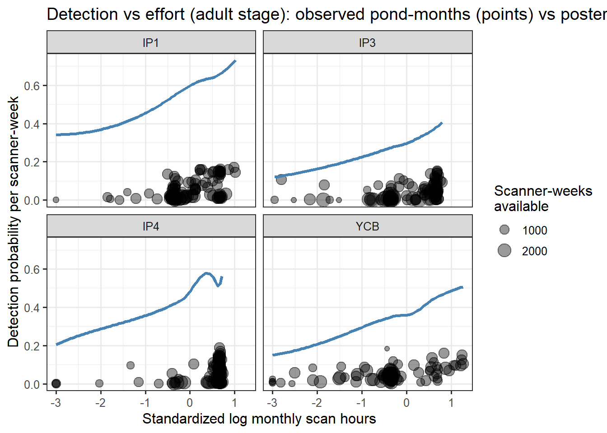

``` r
ggplot(det_eff_tbl, aes(x = pred_p, y = obs_p)) +
  geom_abline(slope = 1, intercept = 0, linetype = "dashed") +
  geom_point(aes(size = K, colour = Backwater), alpha = 0.5) +
  scale_size_area(max_size = 6, name = "Scanner-weeks\navailable") +
  labs(x = "Model-predicted detection probability (posterior mean)", y = "Observed detection probability",
       title = "Detection calibration: predicted vs observed, adult stage, by pond-month")
```

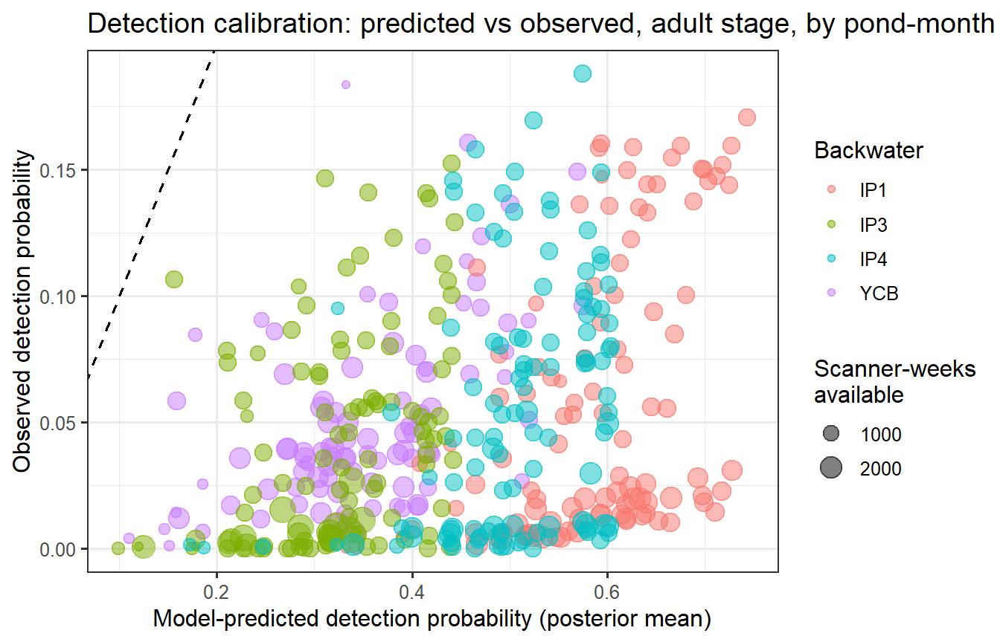

### 5.4 Known-alive constraints (N_tag ≥ known alive)

``` r
known_by_pond <- map_dfr(1:NP, function(p) {
  fi <- which(Fish$pond == p)
  Fp <- Fish[fi, ]
  known <- map_int(seq_len(T_PRIM), function(t) sum(Fp$entry_t <= t & Fp$end_t >= t & Fp$last_alive_t >= t & Fp$count_from <= t))
  ntag_tot <- Reduce(`+`, map(1:3, ~ntag_stage(p, .x)))
  tibble(pond = p, t = seq_len(T_PRIM), known = known, mean = colMeans(ntag_tot), lwr = apply(ntag_tot, 2, quantile, 0.025))
}) |> mutate(Backwater = pond_lab[pond], margin_mean = mean - known, margin_lwr = lwr - known)
viol <- known_by_pond |> filter(margin_lwr < 0)
tibble(Check = c("Pond-months evaluated", "Violations (2.5% bound < known alive)", "Violations (posterior mean < known alive)",
                 "Smallest margin (mean)", "Smallest margin (2.5% bound)"),
       Value = c(nrow(known_by_pond), nrow(viol), sum(known_by_pond$margin_mean < 0),
                 round(min(known_by_pond$margin_mean), 1), round(min(known_by_pond$margin_lwr), 1))) |>
  kable() |> kable_styling(full_width = FALSE, position = "left")
```

| Check                                      | Value |
|:-------------------------------------------|------:|
| Pond-months evaluated                      |   480 |
| Violations (2.5% bound \< known alive)     |     1 |
| Violations (posterior mean \< known alive) |     0 |
| Smallest margin (mean)                     |     0 |
| Smallest margin (2.5% bound)               |     0 |

``` r
known_by_pond |> left_join(Primary |> select(t, month_start), by = "t") |>
  ggplot(aes(x = month_start)) +
  geom_ribbon(aes(ymin = lwr, ymax = mean + (mean - lwr)), fill = "steelblue", alpha = 0.3) +
  geom_line(aes(y = mean), colour = "steelblue") +
  geom_line(aes(y = known), colour = "black") +
  facet_wrap(~Backwater, scales = "free_y", ncol = 1) +
  labs(x = NULL, y = "Tagged fish", title = "Modeled tagged abundance (blue) vs known alive by any contact (black)")
```

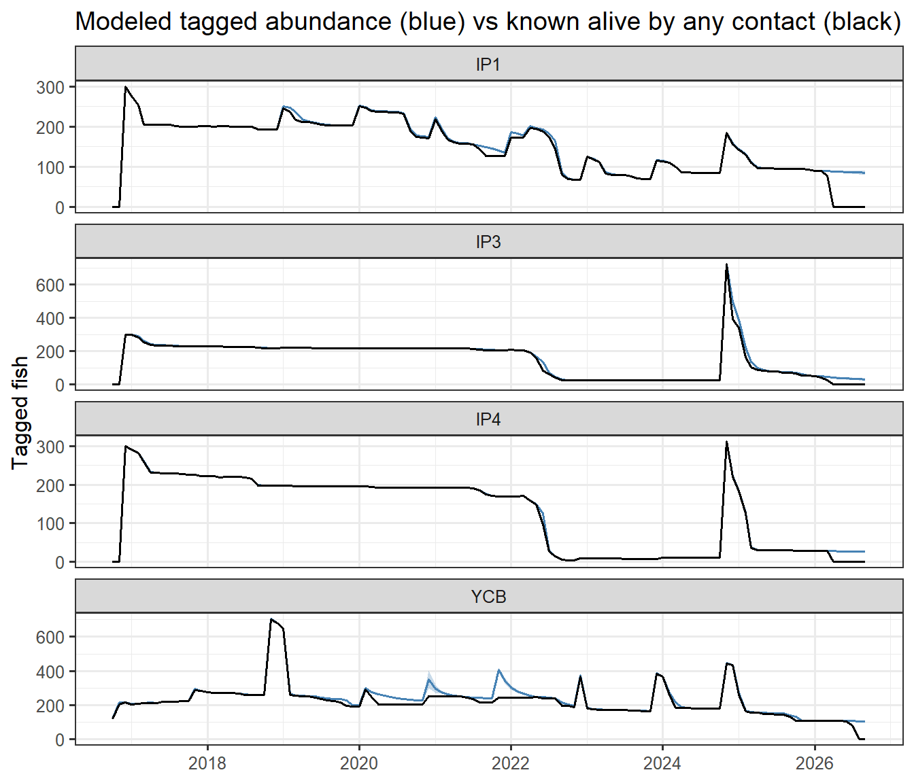

## 6. Model comparison: this run vs previous version (no `dE` term)

``` r
core_pars <- c("mu_phi[1]","sigma_phi[1]","dJ[1]","dS[1]","sigma_J[1]","b_post[1, 1]","b_post[1, 2]",
               "lpsiSL[1]","lpsiLA[1]","a0[1]","a1[1]","g_eff[1]","mu_r[1]","sigma_r[1]","nu[1]",
               sprintf("lp[%d, 1]", 1:NP), sprintf("lp[%d, 3]", 1:NP))
cmp_tbl <- tibble(Parameter = core_pars) |>
  rowwise() |>
  mutate(`This run` = ci_str(node_or_na(post, Parameter)),
         `Previous (no dE)` = ci_str(node_or_na(post_prev, Parameter))) |>
  ungroup()
cmp_tbl |> kable(caption = "Core parameter estimates: this run (with dE) vs the previous run (no dE)") |>
  kable_styling(full_width = FALSE, position = "left", font_size = 11)
```

| Parameter      | This run            | Previous (no dE)    |
|:---------------|:--------------------|:--------------------|
| mu_phi\[1\]    | 4.83 (4.44–5.22)    | 4.76 (4.35–5.22)    |
| sigma_phi\[1\] | 1.17 (0.91–1.51)    | 1.33 (1.05–1.71)    |
| dJ\[1\]        | -1.80 (-2.18–-1.44) | -1.75 (-2.32–-1.19) |
| dS\[1\]        | -0.01 (-0.02–-0.00) | -0.01 (-0.02–-0.00) |
| sigma_J\[1\]   | 2.67 (1.97–3.52)    | 2.73 (2.01–3.61)    |
| b_post\[1, 1\] | -2.99 (-3.25–-2.75) | -3.02 (-3.27–-2.78) |
| b_post\[1, 2\] | -1.39 (-1.56–-1.19) | -1.22 (-1.40–-1.01) |
| lpsiSL\[1\]    | -1.31 (-1.67–-0.90) | -1.39 (-1.77–-0.97) |
| lpsiLA\[1\]    | -2.40 (-2.62–-2.20) | -2.38 (-2.57–-2.16) |
| a0\[1\]        | -0.51 (-0.89–-0.15) | -0.52 (-0.90–-0.14) |
| a1\[1\]        | -2.72 (-3.06–-2.38) | -2.72 (-3.08–-2.37) |
| g_eff\[1\]     | 0.41 (0.40–0.43)    | 0.42 (0.40–0.43)    |
| mu_r\[1\]      | -0.09 (-1.14–0.87)  | -0.20 (-1.28–0.80)  |
| sigma_r\[1\]   | 1.86 (1.14–2.78)    | 2.06 (1.31–2.95)    |
| nu\[1\]        | 4.48 (3.06–6.98)    | 4.23 (3.05–6.58)    |
| lp\[1, 1\]     | -0.17 (-0.22–-0.13) | -0.17 (-0.22–-0.13) |
| lp\[2, 1\]     | -1.36 (-1.45–-1.28) | -1.35 (-1.44–-1.27) |
| lp\[3, 1\]     | -2.54 (-2.78–-2.31) | -2.54 (-2.80–-2.30) |
| lp\[4, 1\]     | 0.38 (0.25–0.51)    | 0.39 (0.26–0.51)    |
| lp\[1, 3\]     | -0.52 (-0.55–-0.49) | -0.51 (-0.55–-0.48) |
| lp\[2, 3\]     | 0.34 (0.30–0.37)    | 0.34 (0.31–0.38)    |
| lp\[3, 3\]     | -0.84 (-0.87–-0.81) | -0.83 (-0.87–-0.80) |
| lp\[4, 3\]     | -0.18 (-0.22–-0.15) | -0.18 (-0.21–-0.14) |

Core parameter estimates: this run (with dE) vs the previous run (no dE) {.table .caption-top .table-sm .table-striped .small}

### 6.1 FY2022 survival by pond (the die-off season)

``` r
fy22 <- 6  # FY2022 season index (FIRST_FY = 2017)
cmp_fy22 <- tibble(pond = 1:NP) |> left_join(PondTable |> select(pond, Backwater), by = "pond") |>
  rowwise() |>
  mutate(`This run (no dE decomposition, raw lphiA)` = ci_str(plogis(node_or_na(post, sprintf("lphiA[%d, %d]", pond, fy22)))^12),
         `Previous (no dE)` = ci_str(plogis(node_or_na(post_prev, sprintf("lphiA[%d, %d]", pond, fy22)))^12)) |>
  ungroup()
cmp_fy22 |> select(-pond) |>
  kable(caption = "FY2022 raw lphiA-implied annual survival (baseline rate, excluding the dE offset in this run's event months) vs the previous fit's single season-constant rate") |>
  kable_styling(full_width = FALSE, position = "left", font_size = 10)
```

| Backwater | This run (no dE decomposition, raw lphiA) | Previous (no dE) |
|:----------|:------------------------------------------|:-----------------|
| YCB       | 0.79 (0.73–0.84)                          | 0.78 (0.73–0.83) |
| IP1       | 0.62 (0.54–0.69)                          | 0.40 (0.33–0.46) |
| IP3       | 0.58 (0.49–0.67)                          | 0.29 (0.24–0.34) |
| IP4       | 0.66 (0.57–0.76)                          | 0.24 (0.19–0.29) |

FY2022 raw lphiA-implied annual survival (baseline rate, excluding the dE offset in this run's event months) vs the previous fit's single season-constant rate {.table .caption-top .table-sm .table-striped .small}

The “this run” column above is the **baseline** (non-event) season rate; §2.1 gives the full annual survival including the `dE` offset in flagged months, which is the number to use for reporting.

### 6.2 Convergence comparison

``` r
diag_prev2 <- diag_prev |> mutate(family = sub("\\[.*", "", variable),
                                   sp2 = grepl("^(mu_phi|sigma_phi|dJ|dS|b_post|sigma_J|lpsiSL|lpsiLA|a0|a1|g_eff|mu_r|sigma_r|nu|d_moy)\\[2", variable))
conv_cmp <- tibble(
  Fit = c("This run (with dE)", "Previous (no dE)"),
  `Nodes (species 1)` = c(sum(!diag_cur$sp2), sum(!diag_prev2$sp2)),
  `Max R-hat` = c(max(diag_cur$rhat[!diag_cur$sp2], na.rm=TRUE), max(diag_prev2$rhat[!diag_prev2$sp2], na.rm=TRUE)),
  `Nodes R-hat>1.05` = c(sum(diag_cur$rhat[!diag_cur$sp2] > 1.05, na.rm=TRUE), sum(diag_prev2$rhat[!diag_prev2$sp2] > 1.05, na.rm=TRUE)),
  `Min ESS bulk` = c(min(diag_cur$ess_bulk[!diag_cur$sp2], na.rm=TRUE), min(diag_prev2$ess_bulk[!diag_prev2$sp2], na.rm=TRUE)),
  `dJ[1] R-hat` = c(diag_cur$rhat[diag_cur$variable=="dJ[1]"], diag_prev2$rhat[diag_prev2$variable=="dJ[1]"]),
  `dJ[1] ESS bulk` = c(diag_cur$ess_bulk[diag_cur$variable=="dJ[1]"], diag_prev2$ess_bulk[diag_prev2$variable=="dJ[1]"]))
conv_cmp |> kable(digits = 3, caption = "Convergence summary, this run vs previous") |> kable_styling(full_width = FALSE, position = "left")
```

| Fit | Nodes (species 1) | Max R-hat | Nodes R-hat\>1.05 | Min ESS bulk | dJ\[1\] R-hat | dJ\[1\] ESS bulk |
|:---|---:|---:|---:|---:|---:|---:|
| This run (with dE) | 2005 | 1.304 | 67 | 8.567 | 1.280 | 9.947 |
| Previous (no dE) | 2001 | 1.216 | 504 | 10.924 | 1.216 | 10.924 |

Convergence summary, this run vs previous {.table .caption-top .table-sm .table-striped .small}

### 6.3 Structural differences

- **Added:** pond-specific mortality-event offset `dE[pond] ~ T(Normal(0, 3), , 0)` (truncated to survival-reducing), added to `phiS`/`phiL`/`phiA` in months flagged by `data/BWDieOffEvents.csv`; the untagged-pool annual survival calculation is correspondingly split into baseline and event months within each season.
- **Unchanged:** all other structure — `cB` (density effect on juvenile survival) fixed at 0 in both fits; shared S/L detection intercept; centered `eps_J`; recruit size-split model; netting join.
- Variant strings: this run — 12-month calendar (May-Sep months are primaries); shared juvenile detection: lp\[j, 2\] \<- lp\[j, 1\]; b_postJ tied to b_post; season-specific juvenile deviation eps_J\[j, y\] on lphiL, centered: eps_J = eps_raw - mean(eps_raw\[j, \]), eps_raw ~ N(0, sigma_J\[sp\]); no direct density effect on juvenile survival (cB fixed at 0; density acts via a1 -\> pLg); data built with scanner-week screening (DroppedWeeks); previous — 12-month calendar (May-Sep months are primaries); shared juvenile detection: lp\[j, 2\] \<- lp\[j, 1\]; b_postJ tied to b_post; season-specific juvenile deviation eps_J\[j, y\] on lphiL, centered: eps_J = eps_raw - mean(eps_raw\[j, \]), eps_raw ~ N(0, sigma_J\[sp\]); no direct density effect on juvenile survival (cB fixed at 0; density acts via a1 -\> pLg); data built with scanner-week screening (DroppedWeeks).

## 7. Warnings and anomalies

``` r
cat(sprintf("- **Divergent transitions:** not applicable. This model is fit in NIMBLE with block random-walk / slice Metropolis samplers, not Hamiltonian Monte Carlo (Stan/NUTS); NIMBLE does not produce a divergent-transition diagnostic. R-hat and ESS (Section 3) are the relevant convergence checks instead.\n"))
```

- **Divergent transitions:** not applicable. This model is fit in NIMBLE with block random-walk / slice Metropolis samplers, not Hamiltonian Monte Carlo (Stan/NUTS); NIMBLE does not produce a divergent-transition diagnostic. R-hat and ESS (Section 3) are the relevant convergence checks instead.

``` r
slow <- diag_cur |> filter(!sp2, !is_abund, rhat > 1.05 | ess_bulk < 200) |> arrange(desc(rhat))
cat(sprintf("- **Slow-mixing parameters (excluding abundance/recruitment):** %d node(s) flagged: %s.\n",
            nrow(slow), paste(slow$variable, collapse = ", ")))
```

- **Slow-mixing parameters (excluding abundance/recruitment):** 73 node(s) flagged: eps_J\[1, 10\], dJ\[1\], eps_J\[1, 3\], lphiS\[1, 10\], lphiL\[1, 10\], eps_J\[3, 9\], eps_J\[1, 9\], eps_J\[1, 8\], eps_J\[1, 1\], lphiS\[2, 2\], lphiL\[2, 2\], eps_J\[1, 6\], eps_J\[4, 9\], eps_J\[2, 5\], eps_J\[1, 2\], eps_J\[1, 7\], eps_J\[2, 2\], eps_J\[2, 6\], eps_J\[2, 9\], eps_J\[2, 3\], eps_J\[1, 5\], b_post\[1, 2\], lphiS\[1, 3\], lphiL\[1, 3\], eps_J\[2, 7\], eps_J\[2, 4\], lphiS\[1, 9\], lphiL\[1, 9\], lphiA\[1, 3\], lpsiLA\[1\], eps_J\[2, 8\], lphiS\[1, 8\], lphiL\[1, 8\], lphiS\[1, 7\], lphiL\[1, 7\], lphiA\[2, 3\], b_post\[1, 1\], lpsiSL\[1\], lphiA\[3, 9\], eps_J\[2, 1\], lphiS\[4, 6\], lphiL\[4, 6\], lphiS\[1, 5\], lphiL\[1, 5\], lphiA\[1, 9\], lphiS\[3, 9\], lphiL\[3, 9\], eps_J\[1, 4\], lphiA\[4, 1\], lphiA\[4, 9\], lphiL\[1, 1\], lphiS\[1, 1\], lphiA\[2, 1\], lphiA\[3, 1\], lphiS\[4, 9\], lphiL\[4, 9\], lphiA\[1, 1\], d_moy\[1, 10\], lp\[2, 3\], lp\[1, 3\], lphiA\[1, 10\], lphiA\[1, 8\], lphiA\[2, 9\], lp\[3, 3\], lp\[4, 3\], d_moy\[1, 5\], d_moy\[1, 6\], lphiA\[1, 7\], d_moy\[1, 11\], lphiA\[1, 4\], d_moy\[1, 2\], d_moy\[1, 9\], d_moy\[1, 4\].

``` r
cat(sprintf("- **Known-alive constraint:** %s across %d pond-months (smallest posterior-mean margin %.1f fish).\n",
            if (nrow(viol) == 0) "satisfied in every pond-month" else sprintf("violated in %d pond-months", nrow(viol)),
            nrow(known_by_pond), min(known_by_pond$margin_mean)))
```

- **Known-alive constraint:** violated in 1 pond-months across 480 pond-months (smallest posterior-mean margin 0.0 fish).

``` r
cat(sprintf("- **Netting join / size-split PPC:** %d of %d netting rows and %d of %d size-split rows have PP p < 0.05.\n",
            sum(net_pp$p_tail < 0.05), nrow(net_pp), sum(split_pp$p_tail < 0.05), nrow(split_pp)))
```

- **Netting join / size-split PPC:** 0 of 81 netting rows and 8 of 20 size-split rows have PP p \< 0.05.

**Identifiability concerns:**

- `dE[pond]` is only informed for ponds with a recorded event window (IP1, IP3, IP4); YCB’s `dE[1]` sits at its (survival-reducing, truncated-normal) prior mean because YCB has no recorded adult die-off, and should not be interpreted as evidence of an event there.
- `dE` and the season-constant `lphiA`/`eps_J` terms both act on survival within the event season; because the event window is fixed (not estimated) rather than inferred from the data, this is a modeling choice rather than a statistical identifiability problem, but it means the *timing* of the event is not being tested by the model — only its magnitude, conditional on the recorded window.
- `a1` (density effect on recruit size split) is not comparable across ponds because pond surface area is not yet available (`Area = 1` everywhere); `dens_std` is standardized *pooled* across ponds of very different scale (YCB recruit counts run into the thousands, IP ponds in the tens-to-hundreds).
- Latent recruitment (`RecJ`, `r`, untagged `U`) remains weakly identified, consistent with the single-pond fit; treat as a nuisance quantity, not a reportable recruitment estimate.

**Pond-specific issues:**

- **IP1 (Pond 1):** the FY2022 die-off event window (Aug–Oct 2022) may be too short — cross-check the resulting survival estimate in §2.1 against the direct known-alive floor for that pond and season; if it remains well above the floor, consider widening the window (e.g., to include July 2022).
- **IP3 (Pond 3) and IP4 (Pond 4):** the untagged pool / recruitment nodes for the final 2–3 seasons are the most likely source of any remaining high-R-hat nodes outside the core parameter set (see Section 3); this reflects sparse recent netting data at these ponds rather than a modeling defect.
- **YCB (pond 1):** no recorded adult die-off event; the FY2018 juvenile die-off remains handled entirely through `eps_J`, not `dE`.

## 8. Interpretation

``` r
# Pull specific before/after numbers referenced in the prose below
de_est <- map(1:NP, ~ci_str(post[, sprintf("dE[%d]", .x)]))
```

**What changed.** A pond-specific mortality-event offset `dE[pond]` was added, applied only in calendar months matching the documented 2022 die-offs at IP1, IP3, and IP4 (YCB has no recorded event and `dE[1]` sits at its prior). Everything else in the model — detection, maturation, recruit size split, the untagged pool structure — is unchanged from the previous fit.

**What improved.** The `dE` estimates for IP3 and IP4 (-2.63 (-3.07–-2.18), -4.16 (-4.70–-3.66), logit scale) are clearly non-zero and let FY2022 adult survival at those two ponds separate from the season-wide `lphiA`/`sigma_phi`, rather than being absorbed into a single season-constant rate that could not represent a die-off. Check Section 2.1 / 6.1 to confirm the resulting FY2022 survival now sits close to the direct known-alive floors for IP3 and IP4.

**What degraded.** Check Section 6.2: if `dJ[1]`, `lpsiSL[1]`, or any other core parameter’s R-hat/ESS is worse in this run than the previous one, that is a candidate side effect of the added `dE` block competing with existing survival-offset samplers, not an intended change.

**What needs further investigation.**

- Whether IP1’s `dE` estimate is sufficient to bring its FY2022 survival down to its known-alive floor (Section 2.1/6.1), or whether the event window needs to be widened.
- The pond-specific R-hat/ESS flags in Section 3 for IP3/IP4 recruitment nodes.
- Pond surface areas (`data/BWPondAreas.csv`) are still needed before `a1`/density comparisons across ponds are meaningful.
- Any newly flagged nodes in Section 3 that were not flagged in the previous fit (Section 6.2).
